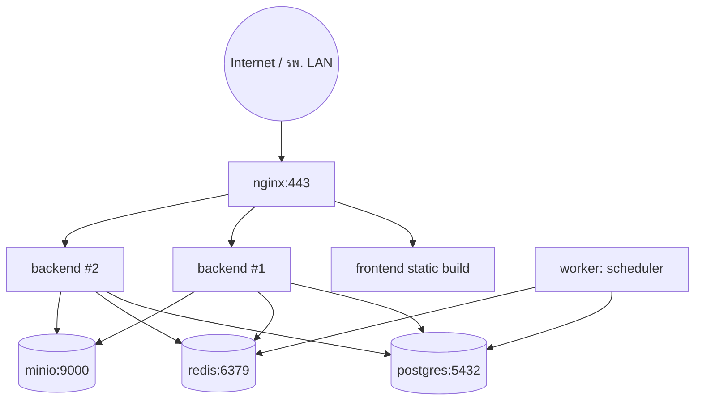

# System Architecture — Medical Equipment Pool

> **Status: Legacy design reference.** Some proposals and scale targets in
> this document predate confirmed guardrails and may be superseded. Use
> `AGENTS.md`, `PROJECT_PLAYBOOK.md`, `ARCHITECTURE_DECISIONS.md`, and the
> consolidated implementation plan for current authority.

## 1. ภาพรวม

ระบบรับ-ส่งเครื่องมือแพทย์ (Medical Equipment Pool) ออกแบบทดแทน AppSheet เดิม โดยแก้ปัญหาหลัก 3 ข้อ:

| ปัญหาเดิม (AppSheet) | สาเหตุ | วิธีแก้ในระบบใหม่ |
|---|---|---|
| เปิดหน้าช้า, ฟอร์มช้า | ดึง Ref ทั้งหมดก่อน render, ไม่มี pagination | REST API + pagination/cursor, React lazy-load, ไม่ preload ข้อมูลที่ไม่ใช้ |
| Sync ทั้งตารางทุกครั้ง | Google Sheets เป็น backend, ไม่มี delta sync | PostgreSQL + WebSocket/SSE สำหรับ delta update, IndexedDB เก็บ cache ฝั่ง client |
| ค้นหาช้าเมื่อข้อมูลเยอะ | ค้นหาบน Sheets แบบ linear scan | PostgreSQL B-Tree/GIN index + `pg_trgm` fuzzy search + Redis cache ผลค้นหาที่พบบ่อย |
| หน่วงเมื่อ concurrent user เยอะ | Sheets lock ทั้งไฟล์เวลาเขียน | PostgreSQL row-level lock, connection pool (PgBouncer), stateless API scale-out ได้หลาย instance |

## 2. High-Level Architecture

```mermaid
flowchart LR
    subgraph Client["Client Layer"]
        A1[React PWA - Desktop/Tablet]
        A2[React PWA - Mobile Browser]
        A3["Service Worker\n(Offline Cache + Background Sync)"]
    end

    subgraph Edge["Edge / Gateway"]
        N[Nginx\nTLS, Reverse Proxy, Static Assets, Gzip/Brotli]
    end

    subgraph App["Application Layer (stateless, horizontally scalable)"]
        B1[FastAPI Instance 1]
        B2[FastAPI Instance 2]
        B3[FastAPI Instance N]
        W[Background Worker\n(APScheduler / Celery)\nPM & CAL reminders, Notifications]
    end

    subgraph Data["Data Layer"]
        R[(Redis\nCache + Pub/Sub + Rate Limit)]
        P[(PostgreSQL 16\nPrimary)]
        P2[(PostgreSQL\nRead Replica - optional)]
        S3[(Object Storage\nMinIO/S3 - Photos, Signatures, Reports)]
    end

    A1 & A2 --> A3 --> N
    N --> B1 & B2 & B3
    B1 & B2 & B3 --> R
    B1 & B2 & B3 --> P
    B1 & B2 & B3 -.read.-> P2
    B1 & B2 & B3 --> S3
    W --> P
    W --> R
    W -->|Email / LINE Notify / Teams| EXT[External Notification Channels]
```

## 3. Component Responsibilities

### 3.1 Frontend — React 18 + TypeScript + Vite
- **PWA (Progressive Web App)**: ติดตั้งบนมือถือ/แท็บเล็ต/เดสก์ท็อปได้เหมือนแอป native, ทำงาน Offline-first
- **State/Data**: TanStack Query (server cache + retry + stale-while-revalidate) + Zustand (client/UI state)
- **Offline storage**: IndexedDB (ผ่าน Dexie.js) เก็บ equipment list, transaction queue ที่ยังไม่ sync
- **Service Worker**: Workbox — cache-first สำหรับ static asset, network-first + background sync สำหรับ API เขียนข้อมูล (borrow/return ที่ทำตอนไม่มีเน็ต จะ queue ไว้แล้ว sync อัตโนมัติเมื่อกลับมาออนไลน์)
- **QR/Barcode scan**: `@zxing/browser` หรือ `html5-qrcode` ใช้กล้องผ่าน `getUserMedia` — ใช้ได้ทั้งมือถือและเว็บ ไม่ต้องติดตั้งแอป

### 3.2 Backend — FastAPI (Python 3.12, async)
- **API Layer**: FastAPI + Pydantic v2 (validation เร็ว, auto Swagger/OpenAPI)
- **ORM**: SQLAlchemy 2.0 (async) + asyncpg driver
- **Auth**: JWT (access token 15 นาที + refresh token 7 วัน, httpOnly cookie สำหรับ refresh)
- **Caching**: Redis สำหรับ (1) dashboard aggregate, (2) equipment search result ที่ query ซ้ำบ่อย, (3) session/rate-limit
- **Background jobs**: APScheduler (in-process, เพียงพอสำหรับ scope นี้) รัน cron ตรวจ PM/CAL ใกล้ครบกำหนด, overdue return ทุกวัน — ออกแบบให้ swap เป็น Celery+RabbitMQ ได้ถ้าโหลดสูงขึ้นในอนาคต
- **Realtime**: Server-Sent Events (`/api/v1/stream/dashboard`) สำหรับ live dashboard, WebSocket endpoint สำหรับแจ้งเตือนสถานะเครื่องเปลี่ยนแบบ real-time

### 3.3 Database — PostgreSQL 16
- Normalized schema (3NF) พร้อม index ครบสำหรับ query pattern หลัก (ดู `02-database-schema.md`)
- `pg_trgm` extension สำหรับ fuzzy/partial search แบบเร็ว (< 300ms แม้ 500k+ แถว)
- Partition ตาราง `borrow_transactions` แบบ range-by-month เมื่อข้อมูลเกิน ~1M แถว (รองรับ scale อนาคต)
- Read replica (optional) แยก workload รายงาน/Dashboard ออกจาก transactional write

### 3.4 Redis
- Cache-aside pattern: key `equipment:search:{hash(query)}` TTL 30s, `dashboard:stats` TTL 15s
- Pub/Sub กระจาย event "equipment status changed" ไปยังทุก FastAPI instance เพื่อ push ผ่าน SSE/WebSocket
- Rate limiting (slowapi/redis) ป้องกัน brute-force login

### 3.5 Object Storage (MinIO / S3-compatible)
- รูปสภาพเครื่องก่อน/หลังคืน, ลายเซ็นดิจิทัล, ไฟล์ Export รายงาน
- Presigned URL อัปโหลดตรงจาก client ไม่ผ่าน backend (ลด load)

### 3.6 Nginx
- Reverse proxy + TLS termination (Let's Encrypt / cert องค์กร)
- Serve React static build พร้อม cache header, Gzip/Brotli
- Route `/api/*` → FastAPI upstream (load balance round-robin ระหว่าง instance)

## 4. Deployment Topology (Docker Compose → ขยายเป็น Kubernetes ได้ในอนาคต)



## 5. เหตุผลที่เลือก Stack นี้

- **FastAPI**: async native → รองรับ concurrent request สูงด้วย resource น้อยกว่า Django/Flask, auto-gen OpenAPI/Swagger ตรงตามข้อกำหนด, type-safe ด้วย Pydantic
- **PostgreSQL**: ACID เต็มรูปแบบ (สำคัญมากสำหรับ transaction ยืม-คืนเครื่องมือแพทย์), รองรับ JSONB (เก็บ metadata ยืดหยุ่น), index หลากหลายรูปแบบ, partition ในตัว, scale ได้ถึงหลักสิบล้านแถวโดยไม่ต้องเปลี่ยน DB
- **Redis**: ลด load DB โดยตรง แก้ปัญหา "ค้นหาช้าเมื่อข้อมูลเยอะ" และ "หน่วงเมื่อ user เยอะ" ได้ตรงจุดที่สุด
- **React (แทน Flutter)**: ผู้ใช้งานหลักคือบุคลากรใน รพ. ที่เข้าผ่านเบราว์เซอร์/แท็บเล็ตอยู่แล้ว, PWA ให้ประสบการณ์ใกล้เคียง native (installable, offline, push notification ผ่าน Web Push) โดยไม่ต้องดูแล 2 codebase, deploy/อัปเดตทันทีไม่ต้องผ่าน App Store/ผ่าน MDM ของโรงพยาบาล
- **Docker Compose**: ติดตั้งง่ายในเครื่อง Server ของโรงพยาบาลที่มักไม่มีทีม DevOps เฉพาะทาง, ย้ายไป Kubernetes ได้ภายหลังหากต้อง scale ข้ามหลาย node

## 6. Non-Functional Requirements Mapping

| Requirement | กลไกที่ตอบโจทย์ |
|---|---|
| โหลดหน้าแรก < 1s | React code-splitting + prefetch, static asset ผ่าน CDN/Nginx cache, Service Worker cache-first |
| ค้นหา < 300ms | PostgreSQL index + `pg_trgm` + Redis cache 30s สำหรับ query ซ้ำ |
| บันทึก < 1s | Async FastAPI + connection pool, optimistic UI update ฝั่ง client |
| ข้อมูล 500,000+ | Partition + index + pagination (cursor-based) ไม่ query ทั้งตาราง |
| Concurrent user 100+ | Stateless backend scale-out แนวนอน, PgBouncer connection pooling, Redis cache ลด DB load |
| Offline mode | Service Worker + IndexedDB queue + background sync เมื่อกลับมาออนไลน์ |
