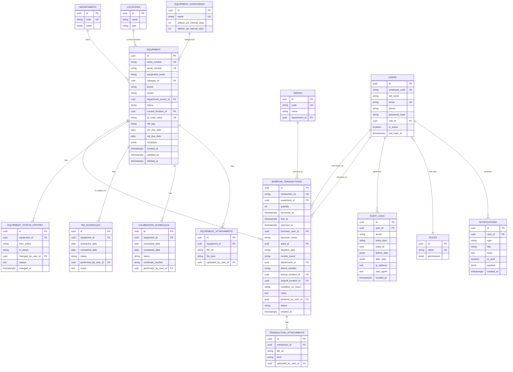

# Database Schema & ER Diagram

> **Status: Legacy design reference.** Some proposals and scale targets in
> this document predate confirmed guardrails and may be superseded. Use
> `AGENTS.md`, `PROJECT_PLAYBOOK.md`, `ARCHITECTURE_DECISIONS.md`, and the
> consolidated implementation plan for current authority.

PostgreSQL 16, schema `public`, 3rd Normal Form. ทุกตารางมี `id UUID` เป็น Primary Key (สร้างด้วย `gen_random_uuid()` — กระจาย insert load ได้ดีกว่า serial เมื่อมีหลาย instance เขียนพร้อมกัน), `created_at`/`updated_at` timestamptz, และ soft-delete (`deleted_at`) สำหรับตารางอ้างอิงหลัก

## 1. ER Diagram



## 2. ตาราง `equipment` (ตารางหลัก)

| Column | Type | Constraint | หมายเหตุ |
|---|---|---|---|
| id | UUID | PK, default `gen_random_uuid()` | |
| asset_number | VARCHAR(50) | UNIQUE, NOT NULL | เลขครุภัณฑ์ |
| serial_number | VARCHAR(100) | UNIQUE | |
| equipment_name | VARCHAR(255) | NOT NULL | |
| category_id | UUID | FK → equipment_categories | |
| brand | VARCHAR(100) | | |
| model | VARCHAR(100) | | |
| department_owner_id | UUID | FK → departments | |
| status | equipment_status (ENUM) | NOT NULL DEFAULT 'available' | available/borrowed/cleaning/pm/calibration/repair/out_of_service/lost |
| current_location_id | UUID | FK → locations | |
| qr_code_value | VARCHAR(64) | UNIQUE, NOT NULL | payload ที่เข้ารหัสใน QR (เช่น `MEP:{asset_number}`) |
| rfid_tag | VARCHAR(64) | NULL | สำรองสำหรับ Future |
| pm_due_date | DATE | | คำนวณ denormalized จาก pm_schedules ล่าสุด เพื่อ query dashboard เร็ว |
| cal_due_date | DATE | | เช่นเดียวกัน |
| metadata | JSONB | DEFAULT '{}' | ฟิลด์เสริมที่ไม่ต้อง migrate schema บ่อย |
| created_at / updated_at / deleted_at | TIMESTAMPTZ | | |

### Index

```sql
CREATE EXTENSION IF NOT EXISTS pg_trgm;
CREATE EXTENSION IF NOT EXISTS "uuid-ossp"; -- หรือใช้ gen_random_uuid() จาก pgcrypto

CREATE INDEX idx_equipment_status ON equipment (status) WHERE deleted_at IS NULL;
CREATE INDEX idx_equipment_dept ON equipment (department_owner_id);
CREATE INDEX idx_equipment_location ON equipment (current_location_id);
CREATE UNIQUE INDEX idx_equipment_qr ON equipment (qr_code_value);
CREATE INDEX idx_equipment_pm_due ON equipment (pm_due_date) WHERE deleted_at IS NULL;
CREATE INDEX idx_equipment_cal_due ON equipment (cal_due_date) WHERE deleted_at IS NULL;

-- Fuzzy / partial search แบบเร็วสำหรับชื่อเครื่อง, asset number, serial number
CREATE INDEX idx_equipment_name_trgm ON equipment USING gin (equipment_name gin_trgm_ops);
CREATE INDEX idx_equipment_asset_trgm ON equipment USING gin (asset_number gin_trgm_ops);
CREATE INDEX idx_equipment_serial_trgm ON equipment USING gin (serial_number gin_trgm_ops);
```

## 3. ตาราง `borrow_transactions`

Partition ตามเดือน (`borrowed_at`) เมื่อข้อมูลโตเกิน ~1M แถว เพื่อให้ query ประวัติล่าสุดเร็วอยู่เสมอโดยไม่ต้อง scan ตารางเก่า

```sql
CREATE TABLE borrow_transactions (
    id UUID PRIMARY KEY DEFAULT gen_random_uuid(),
    transaction_no VARCHAR(30) UNIQUE NOT NULL,
    equipment_id UUID NOT NULL REFERENCES equipment(id),
    quantity INT NOT NULL DEFAULT 1,
    borrowed_at TIMESTAMPTZ NOT NULL DEFAULT now(),
    due_at TIMESTAMPTZ,
    returned_at TIMESTAMPTZ,
    borrower_user_id UUID REFERENCES users(id),
    -- Roadmap PR7 (7b slice): relaxed to nullable (migration 0008_dispatch_fields.py).
    -- No longer accepted/required by the active BorrowRequest contract; every
    -- existing value is preserved as read-only history.
    borrower_name VARCHAR(150),
    ward_id UUID REFERENCES wards(id),
    -- Roadmap PR7 (7b slice): nullable at the DB level -- required for every
    -- new dispatch, enforced at the application layer only (same as ward_id
    -- above), never backfilled for historical rows. 'routine_round' | 'on_demand'.
    dispatch_type VARCHAR(20),
    -- Required exactly when dispatch_type = 'routine_round', NULL otherwise.
    -- One of the four confirmed fixed times: '06:00' | '11:00' | '15:00' | '21:00'.
    routine_round VARCHAR(5),
    department_id UUID REFERENCES departments(id),
    phone_number VARCHAR(20),
    pickup_location_id UUID REFERENCES locations(id),
    dropoff_location_id UUID REFERENCES locations(id),
    condition_on_return VARCHAR(30),
    notes TEXT,
    received_by_user_id UUID REFERENCES users(id),
    status VARCHAR(10) NOT NULL DEFAULT 'open', -- open | closed (Roadmap PR7; knowledge/adr/ADR-005-transaction-model.md -- "overdue" is a disabled notification concept, never a status value)
    created_at TIMESTAMPTZ NOT NULL DEFAULT now(),
    CONSTRAINT ck_borrow_transactions_dispatch_type
        CHECK (dispatch_type IS NULL OR dispatch_type IN ('routine_round', 'on_demand')),
    CONSTRAINT ck_borrow_transactions_routine_round
        CHECK (routine_round IS NULL OR routine_round IN ('06:00', '11:00', '15:00', '21:00')),
    CONSTRAINT ck_borrow_transactions_routine_round_consistency
        CHECK (
            (dispatch_type IS NULL AND routine_round IS NULL)
            OR (dispatch_type = 'on_demand' AND routine_round IS NULL)
            OR (dispatch_type = 'routine_round' AND routine_round IS NOT NULL)
        )
);

CREATE INDEX idx_tx_equipment ON borrow_transactions (equipment_id);
CREATE INDEX idx_tx_status ON borrow_transactions (status);
CREATE INDEX idx_tx_borrowed_at ON borrow_transactions (borrowed_at DESC);
CREATE INDEX idx_tx_ward ON borrow_transactions (ward_id);
CREATE INDEX idx_tx_due_at ON borrow_transactions (due_at) WHERE status = 'open';

-- ป้องกันยืมเครื่องเดียวกันซ้ำซ้อน (1 เครื่อง มีได้แค่ 1 รายการ "open" ที่ยังไม่คืน)
CREATE UNIQUE INDEX idx_tx_one_active_borrow
    ON borrow_transactions (equipment_id)
    WHERE status = 'open';
```

`idx_tx_one_active_borrow` คือกลไกระดับ DB ที่ป้องกัน race condition เวลามีผู้ใช้ 2 คน scan QR ยืมเครื่องเดียวกันพร้อมกัน — DB จะ reject รายการที่สองด้วย unique-violation แทนที่จะพึ่งเช็คที่ application layer อย่างเดียว

## 4. Normalization

- **1NF**: ทุกคอลัมน์เก็บค่าเดียว (atomic), ไม่มี repeating group
- **2NF**: ทุก non-key attribute ขึ้นกับ PK ทั้งหมด (แยก `equipment_categories`, `departments`, `wards`, `locations` ออกจาก `equipment` เพื่อไม่ให้ซ้ำซ้อน)
- **3NF**: ไม่มี transitive dependency — เช่น `ward.department_id` อยู่ในตาราง `wards` ไม่ใช่ซ้ำอยู่ใน `borrow_transactions` (แม้ `borrow_transactions.department_id` จะ denormalize เก็บซ้ำไว้ด้วยเหตุผลด้าน query performance สำหรับ reporting — เป็น deliberate denormalization ที่ sync ผ่าน application layer เวลาสร้าง transaction)

## 5. Migration

ใช้ Alembic (`backend/alembic/versions/`) จัดการ schema migration แบบ versioned — ดูรายละเอียดใน `backend/alembic/`

## 6. Query Pattern สำคัญที่ index รองรับ

1. ค้นหาเครื่องด้วยชื่อ/asset/serial/QR แบบ partial match → `pg_trgm` GIN index, < 300ms แม้ 500k+ แถว
2. Dashboard นับจำนวนตาม status → partial index บน `status`
3. รายการเครื่องใกล้ครบ PM/CAL → index บน `pm_due_date`/`cal_due_date`
4. ประวัติการยืมของเครื่องหนึ่งชิ้น เรียงล่าสุดก่อน → `idx_tx_equipment` + `idx_tx_borrowed_at`
5. ตรวจสอบว่าเครื่อง Available ก่อนยืม → primary lookup บน `equipment.status` + unique partial index กัน double-borrow
