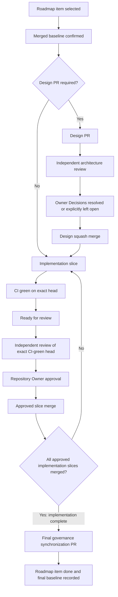

# Engineering Workflow

**Purpose:** Normative engineering execution policy for design,
implementation, review, merge, baseline management, and governance
synchronization.

**Authority:** This document is subordinate to
[`PROJECT_PLAYBOOK.md`](PROJECT_PLAYBOOK.md). The Playbook governs roles,
governance hierarchy, and change control; topic-owning documents govern their
assigned subjects. If this document conflicts with either, the Playbook or the
applicable topic-owning document controls.

**Update trigger:** A change to the engineering delivery, review, merge,
baseline, or governance-synchronization process.

**Maintainer:** Documentation/Governance Engineer with Repository Owner
approval.

## 1. Purpose

This document defines the standard engineering, review, merge, and governance
workflow for the Medical Equipment Pool project. It operationalizes the
governance hierarchy and roles defined by `PROJECT_PLAYBOOK.md`.

The Medical Equipment Pool is production software. It is not a prototype.
Engineering work MUST preserve business correctness, safety, reviewability,
and repository governance from design through merge.

## 2. Scope

This workflow applies to:

- design changes;
- backend implementation;
- frontend implementation;
- database migrations;
- API changes;
- security changes;
- documentation and governance synchronization.

MEMS and Recall Monitor are separate systems. Equipment Pool work MUST NOT
couple to either system unless an explicit Owner-approved architecture decision
and Roadmap change authorize it.

## 3. Roles and Responsibilities

The responsibilities below are normative execution rules that operationalize
the roles defined by `PROJECT_PLAYBOOK.md`; they do not replace or redefine
that authority. Tool names are current operating assignments only and may
change.

The current working model is:

- ChatGPT: architecture and planning;
- Claude: implementation;
- Codex: independent review.

### Architecture and Design

Architecture and design are responsible for:

- business workflow analysis;
- architecture;
- API contract;
- data model direction;
- scope control;
- identifying Owner Decisions.

Design work MUST define business workflow and semantics before UI. It MUST NOT
invent business decisions for technical convenience.

### Implementation

Implementation is responsible for:

- implementing approved design;
- tests;
- migrations;
- validation;
- keeping changes within scope.

Implementation MUST start from a merged and reviewed baseline. It MUST NOT
change lifecycle states, QR identity rules, API contracts, or business
semantics unless the approved design explicitly allows that change.

### Independent Review

Independent review is responsible for:

- correctness;
- architecture consistency;
- business-rule compliance;
- security;
- regression risks;
- documentation consistency;
- exact-head verification.

Reviewers MUST review the actual diff and the relevant surrounding code or
documents. A self-review does not satisfy the independent-review requirement.

### Repository Owner

The Repository Owner is responsible for:

- Owner Decisions;
- merge approval;
- Roadmap priority;
- resolving business-policy ambiguity.

The Repository Owner may approve exceptions, but exceptions MUST be explicit
and documented.

## 4. Standard Delivery Lifecycle

The project architecture order is:

```text
Business Workflow
-> API
-> Frontend
-> Deployment
```

Backend implementation is the source of truth for business rules. Frontend code
MUST consume backend contracts and MUST NOT duplicate or redefine backend
business rules.

Canonical delivery sequence:

1. Roadmap item selected.
2. Repository baseline confirmed.
3. Design PR created when required.
4. Independent architecture review completed.
5. Owner Decisions resolved or explicitly left open.
6. Design merged.
7. Implementation divided into independently reviewable slices.
8. CI passes on the implementation-slice head.
9. Slice is marked Ready for review.
10. Each slice receives independent review of that exact CI-green head.
11. Repository Owner approves the reviewed head and the slice is merged using
    the approved merge method.
12. The exact commit placed on the base branch becomes the next implementation
    baseline.
13. After all approved implementation slices are merged, a final governance
    synchronization PR records Roadmap completion and the final baseline.



## 5. Baseline Management

Every new branch MUST start from the latest approved merged baseline.

Reviewed head SHA and merged baseline SHA are different concepts:

- reviewed head SHA identifies the exact commit reviewed before merge;
- fixed head SHA identifies a later PR head after requested changes;
- re-reviewed head SHA identifies the exact commit reviewed after fixes;
- squash SHA identifies the single commit produced by the default squash-merge
  method;
- merge commit SHA identifies an actual merge commit only when that merge
  method is explicitly approved;
- baseline SHA identifies the exact commit placed on the base branch by the
  approved merge method and used to start subsequent work.

These values MUST NOT be confused. A pre-merge reviewed head is never the
post-merge baseline.

No implementation branch SHOULD start from an unmerged design head. If an
exception is required, it MUST be documented and Owner-approved.

After an approved merge, the exact resulting base-branch commit becomes the
authoritative baseline. Under the default squash-merge method, this is the
squash SHA. For an explicitly approved merge-commit or rebase method, the
resulting base-branch commit and merge method MUST be recorded precisely.
`Merge SHA` MUST NOT be used as a generic synonym for these different values.
Stale baseline references in current-state documents such as `CONTEXT.md` or
`PROJECT_MEMORY.md` are merge blockers for governance-sync PRs.

## 6. Design PR Policy

A Design PR is required when work materially changes:

- business workflow;
- business semantics;
- lifecycle transitions;
- permissions;
- API contract;
- database model;
- reporting semantics;
- cross-module architecture;
- security or information boundaries;
- Roadmap scope.

A Design PR MUST NOT:

- contain implementation;
- create migrations;
- silently change business rules;
- perform premature governance completion.

Design documents MUST include:

- objective;
- current foundation;
- business workflow;
- canonical definitions;
- API proposal;
- backend architecture;
- frontend workflow;
- security;
- performance;
- risks;
- acceptance criteria;
- out-of-scope items;
- Owner Decisions;
- implementation slices.

## 7. Owner Decision Policy

An Owner Decision is required only for unresolved business policy.

Technical implementation details SHOULD normally be resolved by architecture
and review. Open Owner Decisions MUST be clearly documented.

Implementation depending on an open Owner Decision MUST NOT begin. Unrelated
implementation slices MAY proceed only when they are genuinely independent of
the open decision.

An open Owner Decision MUST NOT be used to falsely declare a Roadmap item
complete. Accepted Owner Decisions MUST be recorded in `docs/DECISION_LOG.md`
through an appropriate reviewed PR.

## 8. Implementation Slice Policy

Each implementation slice MUST:

- start from a merged baseline;
- have one coherent responsibility;
- be independently reviewable;
- include relevant tests;
- avoid unrelated cleanup;
- avoid future Roadmap scope;
- preserve existing contracts unless a change is explicitly approved.

Incremental implementation is preferred over a large combined PR.

Valid slice boundaries MAY include:

- domain/query foundation;
- schema and migration;
- API;
- frontend;
- governance synchronization.

These slice types are examples, not prescriptions. Boundaries MUST follow the
architecture of the work.

## 9. Pull Request Requirements

Every PR description SHOULD include:

- objective;
- baseline SHA;
- scope;
- files or modules changed;
- out-of-scope items;
- tests and validation performed;
- migrations, if any;
- API compatibility impact;
- security impact;
- rollback considerations;
- linked Roadmap item or design document.

The PR description MUST match the actual file count and scope.

Metadata-only PR description corrections do not require a commit or re-review
unless they reveal a substantive scope change.

## 10. Independent Review Policy

Reviews MUST distinguish:

- GitHub action;
- substantive decision.

Allowed substantive decisions are:

- APPROVE;
- APPROVE WITH NON-BLOCKING COMMENTS;
- REQUEST CHANGES.

If GitHub prevents `APPROVE` or `REQUEST_CHANGES` because the reviewer owns the
PR, the reviewer MAY submit `COMMENT` while stating the substantive decision
explicitly.

Review priorities are:

1. business-rule correctness;
2. architecture and contract consistency;
3. security and privacy boundaries;
4. data integrity;
5. migrations;
6. regression risk;
7. performance;
8. tests;
9. maintainability;
10. documentation consistency.

A green CI run does not override a design or correctness blocker.

## 11. Exact-Head Review and CI

Every review MUST record the exact reviewed head SHA.

CI MUST pass on that exact SHA before merge. A new commit invalidates earlier
exact-head merge readiness.

Documentation-only metadata changes outside Git history do not change the head
SHA. Merge MAY proceed only when required checks, branch protection, and review
conversations are satisfied.

## 12. Incremental Review

After requested changes, reviewers MUST:

- review the delta from the previous reviewed head to the new head;
- confirm each prior finding as resolved, partially resolved, or unresolved;
- inspect the final full PR state for contradictions;
- identify regressions introduced by the fix.

Reviewers SHOULD NOT require a full new design review when changes are narrowly
scoped. Reviewers MUST NOT skip full-state consistency checks merely because
the review is incremental.

## 13. Merge Policy

The default merge method is squash merge.

Before merge, verify:

- substantive review approval;
- exact-head CI green;
- mergeable state clean;
- required conversations resolved;
- PR description accurate;
- no unapproved scope expansion.

After merge:

- record the exact resulting base-branch commit as the new baseline; under the
  default squash-merge method, this is the squash SHA;
- create the next branch only from that baseline;
- do not refer to a pre-merge reviewed head as the baseline.

## 14. Governance Synchronization Policy

Final governance synchronization is a separate step after all approved
implementation slices for a Roadmap item are merged. At that point,
implementation is complete, but the Roadmap item is not done until the final
governance synchronization is merged. That merge records Roadmap completion
and establishes the final baseline.

This final synchronization requirement does not prohibit focused current-state
or status corrections after an individual merge when needed to keep
documentation truthful during multi-slice work. Such corrections MUST NOT
falsely declare the whole Roadmap item done.

It MUST update all applicable current-state documents consistently:

- `docs/ROADMAP.md`;
- `docs/ROADMAP_STATUS.md`;
- `docs/DECISION_LOG.md`;
- `knowledge/CHANGE_HISTORY.md`;
- `knowledge/CONTEXT.md`;
- `knowledge/PROJECT_MEMORY.md`.

Rules:

- do not declare a Roadmap item complete while required slices remain
  unfinished;
- do not advance the next Roadmap item while an unresolved decision still
  blocks the active item, unless an explicitly approved scope amendment exists;
- implementation sub-slices do not individually trigger Roadmap completion;
- governance documents must use the actual merged baseline and correct review
  chronology.

## 15. Testing and Validation Standards

Testing MUST be appropriate to the change.

Backend validation SHOULD include:

- unit tests;
- service/domain tests;
- API tests;
- authorization tests;
- PostgreSQL-specific tests where behavior depends on PostgreSQL;
- migration upgrade validation.

Frontend validation SHOULD include:

- rendering and interaction tests;
- API parameter serialization;
- loading, empty, and error states;
- contract compatibility;
- mobile-first behavior where relevant.

Documentation validation SHOULD include:

- `git diff --check`;
- internal consistency;
- correct SHA and PR chronology;
- no stale Roadmap or baseline claims.

Tests MUST verify business invariants, not only implementation details.

## 16. API and Schema Compatibility

Existing APIs remain unchanged unless the design explicitly approves a contract
change.

Additive fields are still contract changes and MUST be documented.
Presentation fields specific to reports SHOULD use report-specific DTOs.

Database schemas MUST never be exposed directly to the frontend. APIs SHOULD
remain versionable. Error responses and HTTP status codes MUST be consistent.
Frontend code MUST NOT duplicate backend business rules.

## 17. Database and Migration Policy

PostgreSQL is authoritative.

SQLAlchemy models and Alembic migrations MUST remain synchronized. Every schema
change requires a migration.

Migrations MUST avoid breaking existing data. Migration review MUST consider
existing data, upgrade behavior, downgrade or forward-recovery behavior, and
fresh-database convergence.

Upgrade validation is required for schema changes. Rollback or forward-recovery
strategy MUST be documented.

SQLite compatibility helpers MUST NOT accidentally redefine PostgreSQL
behavior.

## 18. Security and Privacy Review

Every relevant PR MUST consider:

- authentication;
- authorization;
- least privilege;
- role visibility;
- new information boundaries;
- PII exposure;
- historical data visibility;
- audit implications;
- sensitive logging;
- enumeration risks.

A narrower payload is not automatically safe if it creates a new directory or
lookup surface.

## 19. Scope and Roadmap Boundaries

Each PR MUST remain within its active Roadmap item.

Future Roadmap work MUST NOT be implemented early. Compatibility planning is
allowed; future implementation is not.

Printing/export functionality MUST remain in its assigned Roadmap item. MEMS
and Recall Monitor MUST NOT be coupled into Equipment Pool work.

Existing lifecycle states and QR identity rules MUST NOT be changed without
explicit Owner approval.

## 20. Definition of Ready

A work item is ready for implementation when:

- business workflow is understood;
- canonical semantics are documented;
- required Owner Decisions are resolved;
- API and architecture boundaries are clear;
- acceptance criteria are measurable;
- scope and out-of-scope are explicit;
- implementation slices are identified;
- design PR is merged when required;
- implementation baseline is confirmed.

## 21. Definition of Done

A Roadmap item is done only when:

- all approved implementation slices are merged;
- tests pass;
- CI passes on each merged slice's reviewed head;
- required Owner Decisions are recorded;
- no known merge blockers remain;
- documentation matches implementation;
- governance synchronization is merged;
- the exact base-branch commit resulting from the final governance merge
  becomes the new baseline; under the default squash-merge method, this is the
  squash SHA.

## 22. Exception Policy

Exceptions require explicit documentation and Owner approval.

An exception MUST state:

- why the normal workflow cannot be followed;
- risks;
- mitigations;
- scope;
- expiration or follow-up plan.

Convenience alone is not sufficient justification.
