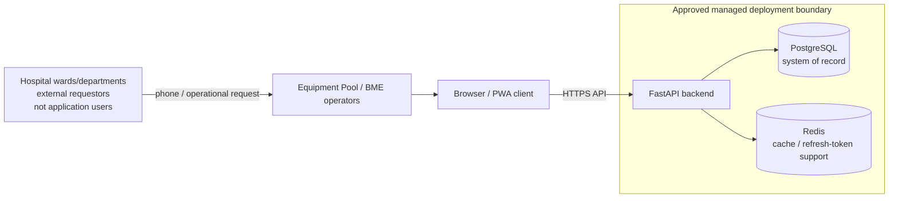
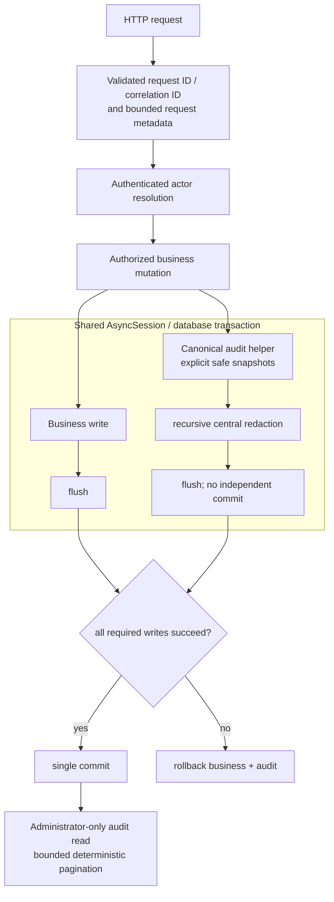
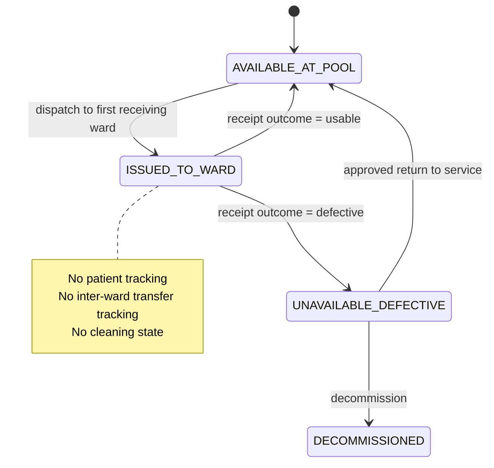

# Architecture Diagrams

These diagrams are navigation aids, not independent requirements. Text in
[`../ARCHITECTURE_DECISIONS.md`](../ARCHITECTURE_DECISIONS.md),
[`../HOSPITAL_DOMAIN_MODEL.md`](../HOSPITAL_DOMAIN_MODEL.md), and the assigned
Roadmap section remains authoritative.

## System context

The application does not assume direct access to hospital-managed servers.
Deployment-provider detail remains unselected. See “Managed deployment
preferred” in `ARCHITECTURE_DECISIONS.md`.

## Audit and transaction flow

Authentication-event persistence has its separately documented availability
strategy; unknown failed-login identifiers have null actor/subject and no
persisted identity representation. See
[`../adr/ADR-0001-canonical-audit-and-failed-login-identifiers.md`](../adr/ADR-0001-canonical-audit-and-failed-login-identifiers.md).

## Equipment Pool domain flow

Shift Sessions and Standby Snapshots are confirmed future concepts outside this
state machine. They are not inferred from transactions and are not introduced by
these diagrams.
