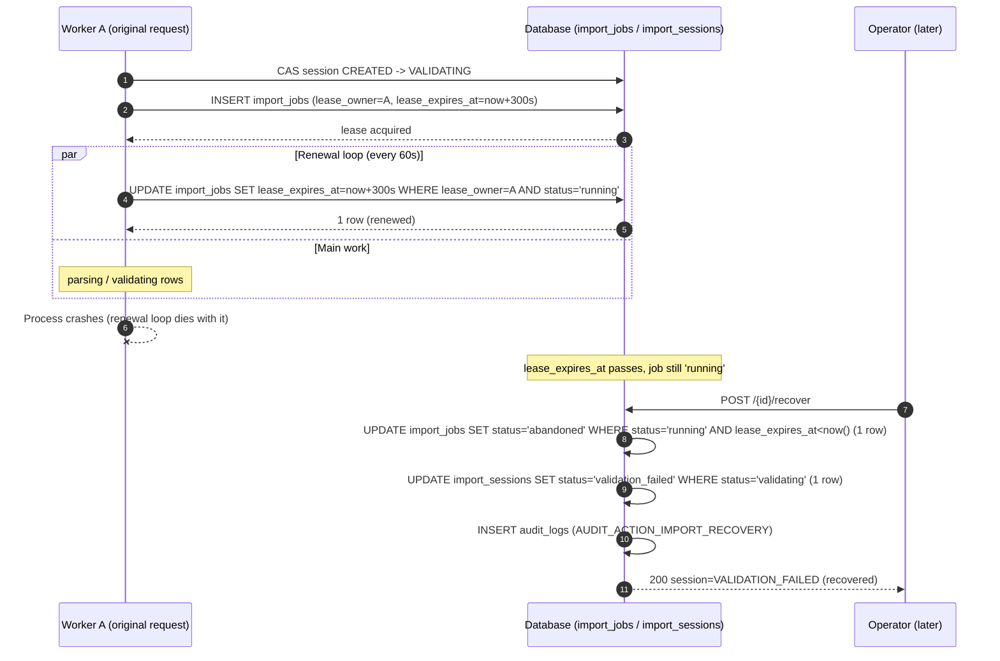

# Roadmap PR19A — Legacy Import Foundation: Design (Governance)

**Status:** Design only. No runtime code, migration, API, or test file is part of this PR. Nothing in this document has been implemented.
**Repository:** Medical Equipment Pool. Not MEMS, not Recall Monitor.
**Baseline:** `729d1aa2f40db60a6056ecbb5bc1ab8e64e92e52` (`docs(governance): close Roadmap PR18 printing and export (#79)`) — Roadmap PR18 is fully merged and governance-synced at this commit. This design branches directly from that commit.
**Scope authority:** `docs/audits/04-consolidated-implementation-plan.md` Part D, Group 8, "PR19 — Legacy Import Foundation."
**Supersedes:** PR #81 (`feature/pr19a-legacy-import-foundation`, head `c3813bc93f2100dcb06f02ab9e3098faa61e1706`), which bundled this design with runtime implementation in a single commit — flagged merge-blocking by independent review. **PR #81 has already been closed, unmerged**; its branch is retained temporarily.
**Revision history:**
- Rev 1 (head `b142f4d`) resolved PR #81's original findings.
- Rev 2 (head `3c0c8d9`) resolved review comment `5165925838` (D1–D5/M1).
- Rev 3 (head `a152617`) resolved review round 2 (H1–H5/M1) and recorded Owner Decision: Data Retention Policy.
- **Rev 4 (this revision)** resolves review round 3 (REQUEST CHANGES against head `a152617138f528b5acfea5e9ea10fe23a0080a24`): (1) the lease had no renewal and no completion fencing tied to `lease_owner`, so a job presumed dead could still be recovered while its original worker was genuinely still running, risking a late commit after recovery; (2) session-creation idempotency and `ImportSource` binding were two separate identity mechanisms that could disagree; (3) the approved 180-day retention policy had no enforcement mechanism shipping with any implementation slice; (4) PR19A2/PR19A3 ownership of the lease/recovery mechanism did not match which slice actually owns the `dry-run` endpoint. All four are resolved below, with two sequence diagrams (§8.3) illustrating the exact race the review identified and how it is now prevented.

---

## 1. Objective

Design the complete backend architecture required to eventually import historical AppSheet data into this system, such that an implementer can answer every question in §24 (Acceptance Criteria) without guessing. No parser, no legacy data import, and no UI are in scope for the resulting implementation slices (§22).

---

## 2. Inputs Reviewed

| Area | Source | What it established |
|---|---|---|
| Roadmap scope | `docs/audits/04-consolidated-implementation-plan.md` Part D, Group 8 | PR19 is "Legacy Import Foundation" — architecture only. |
| Engineering process | `docs/ENGINEERING_WORKFLOW.md` §6 | A Design PR must precede implementation and define the API proposal, data-model direction, security/information boundaries, performance, risks, acceptance criteria, and slices. |
| PR #81 review | GitHub PR #81 comment `5164590001` | Resolved in §6–§7, §10–§11, §18, §21 (unchanged since Rev 1). |
| PR #83 Rev 1 review | Comment `5165925838` (D1–D5/M1) | Resolved in Rev 2 — domain model, API/RBAC, security/risk, source-persistence scope boundary, validation-snapshot pointer, dry-run read-only transaction. |
| PR #83 Rev 2 review | Round 2, H1–H5/M1 | Resolved in Rev 3 — lease/heartbeat schema, database-enforced source-registration concurrency, composite ownership FK, physical schema contract, retention Owner Decision. |
| **PR #83 Rev 3 review** | **Round 3, this revision's findings** | **Lease renewal + completion fencing (§8.2–§8.3). Unified source/checksum/fingerprint contract (§14). Retention cleanup moved into PR19A3 (§9, §19, §22). A2/A3 ownership reconciled against the actual endpoint-ownership table (§22).** |
| Owner Decision | Rev 3 | Data retention policy (§9), recorded in `docs/DECISION_LOG.md`. |
| Prior import precedent | Roadmap PR12 | Bounded row count, bulk-lookup validation, safe generic error wrapping, Administrator-only gate, `ge=1` pagination, bounded decompressed-archive size. |
| Schema-hygiene precedent | Migrations `0013`/`0014` | "Verify → classify → transform/no-op/fail-closed"; explicit `ON DELETE RESTRICT` everywhere. |
| Timestamp policy precedent | Roadmap PR15B (migration `0012`) | Every persisted timestamp is `TIMESTAMPTZ`, UTC-stored. |

---

## 3. Domain Model Contract (Conceptual)

Conceptual entity model — purpose, ownership, relationships, information sensitivity. The literal physical schema is §4; the public API vocabulary is §19. This section deliberately does not repeat either.

### 3.1 ImportSession

*(persisted as `import_sessions`)* — one staged import attempt for one dataset type; the root aggregate. Owned by `created_by_user_id`. Relationships: 1:1 `ImportSource` (§3.2); 1:N `ImportJob` (§3.3). Sensitive fields: `notes`, `failure_reason`. Retention: §9, anchored on `terminal_at`.

### 3.2 ImportSource

*(persisted as `import_sources`)* — **the single source-of-truth identity/checksum record for a session's data** (§14 — unified in this revision; session creation itself carries no identity field of its own). Does not store raw bytes in this foundation (§8.1). Sensitive fields: `filename` (§20). Retention: §9 — descriptive fields redacted; `checksum` retained.

### 3.3 ImportJob — backing entity for ValidationAttempt / DryRunAttempt / ExecutionAttempt

*(persisted as `import_jobs`; public API concept names: `ValidationAttempt`, `DryRunAttempt`, `ExecutionAttempt` — one table, discriminated by `job_type`)* — one execution record of one phase, now also the **fencing token holder** (`lease_owner`, §8.2). Sensitive fields: `error_message`. Retention: retained (system-outcome text, §9).

### 3.4 ValidationFinding

*(persisted as `import_row_errors`)* — one collected finding, attributed to a `ValidationAttempt` via `import_job_id`. Sensitive fields: `message`/`field` (§20). Retention: redacted post-retention; structural fields retained (§9).

### 3.5 ImportAuditEvent — integration with the existing audit log

Not a new table. Four action constants: `AUDIT_ACTION_IMPORT` (execute success, existing), `AUDIT_ACTION_IMPORT_RECOVERY` (lease-expiry recovery, §8.2), **`AUDIT_ACTION_IMPORT_FENCE_LOST`** (new, Rev 4 — a late worker's commit was correctly discarded after recovery already claimed its job, §8.3), `AUDIT_ACTION_IMPORT_RETENTION_CLEANUP` (§9, now a PR19A3 deliverable). No schema change to `audit_logs` itself.

### 3.6 No source-storage reference table

Unchanged — explicitly not part of this foundation's schema (§8.1).

---

## 4. Physical Schema Contract

Every table this feature introduces. Internal persistence only — never exposed directly as API fields (§19 is the public vocabulary). Conventions: enum columns are `VARCHAR` + named `CHECK` (`create_constraint=True` on the ORM side, §7); every timestamp is `TIMESTAMPTZ`; every FK is `ON DELETE RESTRICT`; UUIDs are application-generated.

### 4.1 `import_sessions`

| Column | Type | Null | Default | Notes |
|---|---|---|---|---|
| `id` | UUID | NOT NULL | app-generated | PK |
| `dataset_type` | VARCHAR(100) | NOT NULL | — | |
| `status` | VARCHAR(30) | NOT NULL | `'created'` | `CHECK` (§5) |
| `created_by_user_id` | UUID | NOT NULL | — | FK → `users.id` RESTRICT |
| `idempotency_key` | VARCHAR(200) | NULL | — | |
| `notes` | TEXT | NULL | — | `CHECK char_length(notes) <= 4000`; redacted post-retention |
| `current_validation_job_id` | UUID | NULL | — | Composite FK, §4.5/§12 |
| `validated_at`, `dry_run_completed_at`, `executed_at` | TIMESTAMPTZ | NULL | — | |
| `terminal_at` | TIMESTAMPTZ | NULL | — | Retention-clock anchor (§9); set only for `COMPLETED`/`FAILED`/`CANCELLED` |
| `retention_purged_at` | TIMESTAMPTZ | NULL | — | Cleanup idempotency guard (§9) |
| `total_rows`, `valid_rows`, `invalid_rows`, `warning_rows`, `imported_rows` | INTEGER | NULL | — | |
| `failure_reason` | TEXT | NULL | — | `CHECK char_length(failure_reason) <= 2000`; retained post-retention |
| `created_at`, `updated_at` | TIMESTAMPTZ | NOT NULL | `now()` | |

**Removed in Rev 4:** `idempotency_fingerprint`. Session creation no longer carries any identity-bearing field beyond `(dataset_type, idempotency_key)` itself (§14.1) — the field it used to hash (`source_checksum`) has moved exclusively to `import_sources` (§14.2), so there is nothing left to fingerprint at creation time; the existing `UNIQUE(dataset_type, idempotency_key)` constraint is now sufficient on its own.

**Keys/constraints:** PK `id`. `UNIQUE (dataset_type, idempotency_key)`. Composite FK `(id, current_validation_job_id)` → `import_jobs (import_session_id, id)`, `MATCH SIMPLE`, `ON DELETE RESTRICT` (§4.5). `INDEX (dataset_type, status)`. `INDEX (created_by_user_id)`. `INDEX (terminal_at)`.

### 4.2 `import_sources` — the single identity/checksum record (§14, unchanged from Rev 3)

| Column | Type | Null | Default | Notes |
|---|---|---|---|---|
| `id` | UUID | NOT NULL | app-generated | PK |
| `import_session_id` | UUID | NOT NULL | — | FK → `import_sessions.id` RESTRICT, `UNIQUE` |
| `checksum` | VARCHAR(128) | NOT NULL | — | `CHECK char_length(checksum) >= 32`; immutable once set; retained post-retention |
| `byte_size` | BIGINT | NOT NULL | — | Part of the identity fingerprint |
| `content_type` | VARCHAR(255) | NULL | — | Redacted post-retention |
| `filename` | VARCHAR(255) | NULL | — | Redacted post-retention (§20) |
| `source_version` | VARCHAR(100) | NULL | — | |
| `options_fingerprint` | VARCHAR(64) | NOT NULL | — | SHA-256 hex of normalized options; defaults to hash of `{}` |
| `source_fingerprint` | VARCHAR(64) | NOT NULL | — | Full composite identity hash, §14.2 |
| `created_at` | TIMESTAMPTZ | NOT NULL | `now()` | |

**Keys/constraints:** PK `id`. `UNIQUE (import_session_id)`. `INDEX (checksum)`. FK `import_session_id` → `import_sessions.id` RESTRICT.

### 4.3 `import_jobs`

| Column | Type | Null | Default | Notes |
|---|---|---|---|---|
| `id` | UUID | NOT NULL | app-generated | PK |
| `import_session_id` | UUID | NOT NULL | — | FK → `import_sessions.id` RESTRICT |
| `job_type` | VARCHAR(20) | NOT NULL | — | `CHECK job_type IN ('validate','dry_run','execute')` |
| `status` | VARCHAR(20) | NOT NULL | `'pending'` | `CHECK status IN ('pending','running','succeeded','failed','abandoned')` |
| `attempt_number` | INTEGER | NOT NULL | — | Monotonic per `(import_session_id, job_type)` |
| `lease_owner` | UUID | NULL | — | **The fencing token (§8.2).** Set fresh at lease acquisition; every completion write (success or failure) must present this same token or be discarded |
| `lease_expires_at` | TIMESTAMPTZ | NULL | — | `now() + IMPORT_JOB_LEASE_DURATION_SECONDS` (default 300s) at acquisition, **and at every successful renewal** (§8.2 — Rev 4: renewal is now real, not merely reserved schema) |
| `heartbeat_at` | TIMESTAMPTZ | NULL | — | Last successful renewal timestamp — observability ("when did we last hear from this worker"), distinct from the forward-looking `lease_expires_at` |
| `started_at`, `finished_at` | TIMESTAMPTZ | NULL | — | |
| `error_message` | TEXT | NULL | — | `CHECK char_length(error_message) <= 2000`; retained post-retention |
| `ruleset_version` | VARCHAR(50) | NULL | — | VALIDATE jobs only |
| `created_at` | TIMESTAMPTZ | NOT NULL | `now()` | |

**Keys/constraints:** PK `id`. FK `import_session_id` → `import_sessions.id` RESTRICT. `UNIQUE (import_session_id, id)` (composite-FK target, §4.5). `UNIQUE (import_session_id, job_type, attempt_number)`. `INDEX (import_session_id, job_type)`. `INDEX (lease_expires_at) WHERE status = 'running'` (partial index, supports both the recovery scan and — new in Rev 4 — is also useful for operational monitoring of renewal health).

### 4.4 `import_row_errors` (ValidationFinding)

Unchanged from Rev 3: `id`, `import_job_id` (FK RESTRICT), `row_number`, `field` (redacted post-retention), `error_code` (retained), `message` NOT NULL (redacted post-retention via placeholder, never a real `NULL`), `severity` (`CHECK IN ('error','warning')`). PK `id`. `INDEX (import_job_id, row_number)`.

### 4.5 The composite ownership foreign key (unchanged from Rev 3)

```sql
ALTER TABLE import_jobs
  ADD CONSTRAINT uq_import_jobs_session_id UNIQUE (import_session_id, id);

ALTER TABLE import_sessions
  ADD CONSTRAINT fk_import_sessions_current_validation_job
  FOREIGN KEY (id, current_validation_job_id)
  REFERENCES import_jobs (import_session_id, id)
  ON DELETE RESTRICT;
```

`MATCH SIMPLE` — not evaluated while `current_validation_job_id IS NULL`. Enforced by the database, not only application code. See Rev 3 for the full rationale (unchanged).

### 4.6 Schema-convergence matrix

Unchanged objects from Rev 3 (`ck_import_sessions_status`, `ck_import_jobs_status`, `ck_import_jobs_job_type`, `ck_import_row_errors_severity`, `uq_import_jobs_session_id`, `fk_import_sessions_current_validation_job`, `uq_import_jobs_session_job_type_attempt`, `ix_import_jobs_lease_expires_at`). **All schema convergence testing, for every table and every column regardless of which slice later populates or reads it, is entirely PR19A1's testing responsibility** (§22) — a column a later slice merely *uses* (e.g. `lease_owner`, `ruleset_version`) was still *created* by PR19A1's migration, and PR19A1's own convergence tests must cover it.

---

## 5. Import Session Lifecycle and Allowed Transitions

Unchanged from Rev 3.

```
CREATED
VALIDATING
VALIDATED
VALIDATION_FAILED
DRY_RUN_RUNNING
DRY_RUN_COMPLETED
DRY_RUN_FAILED
EXECUTING
COMPLETED
FAILED
CANCELLED
```

| From | Trigger | To |
|---|---|---|
| `CREATED` | validate | `VALIDATING` |
| `VALIDATING` | (internal) | `VALIDATED` \| `VALIDATION_FAILED` |
| `VALIDATED` | re-validate | `VALIDATING` |
| `VALIDATION_FAILED` | re-validate | `VALIDATING` |
| `VALIDATED` | dry-run | `DRY_RUN_RUNNING` |
| `DRY_RUN_RUNNING` | (internal) | `DRY_RUN_COMPLETED` \| `DRY_RUN_FAILED` |
| `DRY_RUN_COMPLETED` | re-dry-run | `DRY_RUN_RUNNING` |
| `DRY_RUN_FAILED` | re-dry-run | `DRY_RUN_RUNNING` |
| `DRY_RUN_COMPLETED` | execute | `EXECUTING` |
| `EXECUTING` | (internal) | `COMPLETED` \| `FAILED` |
| `{CREATED, VALIDATED, VALIDATION_FAILED, DRY_RUN_COMPLETED, DRY_RUN_FAILED}` | cancel | `CANCELLED` |

Terminal: `COMPLETED`/`FAILED`/`CANCELLED` (set `terminal_at`, §9). `VALIDATION_FAILED`/`DRY_RUN_FAILED` are not terminal.

---

## 6. Atomic Transition and Concurrency Policy

Unchanged: atomic conditional `UPDATE ... WHERE status = ANY(:allowed) RETURNING id`, executed via SQLAlchemy Core, never load-then-mutate-then-commit.

---

## 7. Fresh-Install / Historical-Upgrade Schema Convergence

Unchanged: `_StrEnum(create_constraint=True)`; verify → classify → transform/no-op/fail-closed for every table; PR19A1 acceptance criteria cover fresh-install vs. historical-upgrade convergence for every object in §4.6.

---

## 8. Source Persistence and Crash Recovery

### 8.1 Source persistence — explicit scope boundary (unchanged)

No code in PR19A1–A3 stores or re-reads source bytes. Deferred to PR19B.

### 8.2 Lease, renewal, and completion fencing (rewritten, Rev 4)

**What was missing:** Rev 3 defined lease acquisition (`lease_owner`/`lease_expires_at`/`heartbeat_at` set once) and a recovery claim, but never renewed the lease during real work, and never checked the lease at *completion* time. Two consequences the review correctly identified: (1) a legitimately-still-running worker whose lease merely expired (not crashed — e.g., slow processing, transient DB latency, brief network partition) could be wrongly recovered while genuinely alive; (2) that same worker, unaware it had been recovered, could finish and commit its result afterward — a **late commit**, potentially duplicating a write `/recover` had already resolved.

**Lease renewal — a background task within the same request, not a separate scheduler:**

This foundation's phases run synchronously within one HTTP request. Renewal is implemented as an `asyncio.create_task` started immediately after lease acquisition, running concurrently with the phase's main work (the `asyncio.to_thread`-offloaded parse, the per-record validation loop, `plan_dry_run`, or `execute`), and cancelled in a `finally` block once that work completes:

```python
async def _renew_lease_loop(session_factory, job_id, lease_owner):
    while True:
        await asyncio.sleep(IMPORT_JOB_HEARTBEAT_INTERVAL_SECONDS)
        async with session_factory() as db:  # a session of its OWN — never shared
            result = await db.execute(         # with the main work's session/transaction
                update(ImportJob)
                .where(ImportJob.id == job_id,
                       ImportJob.lease_owner == lease_owner,
                       ImportJob.status == "running")
                .values(lease_expires_at=func.now() + IMPORT_JOB_LEASE_DURATION,
                        heartbeat_at=func.now())
                .returning(ImportJob.id)
            )
            await db.commit()
            if result.first() is None:
                return  # lost the lease -- stop renewing; the completion fence (below)
                        # is what actually prevents a bad commit, not this early exit
```

**The renewal task uses its own `AsyncSession`, never the phase's main session** — `AsyncSession` is not safe for concurrent use from two coroutines, and the renewal write must commit promptly and independently of however long the main work's own transaction stays open. `IMPORT_JOB_HEARTBEAT_INTERVAL_SECONDS` (default 60s) is deliberately well under `IMPORT_JOB_LEASE_DURATION_SECONDS` (default 300s, unchanged) — a 5× margin so one missed renewal (transient latency) does not immediately produce a false-positive stale recovery.

**Completion fencing — the actual safety guarantee, independent of whether the worker ever notices it lost the lease:**

Every completion write (§6's "step 2" success *or* failure path) is now conditioned on presenting the same `lease_owner` token acquired at the start, in the **same transaction** as any real data writes:

```sql
UPDATE import_jobs
SET status = 'succeeded', finished_at = now(), ...
WHERE id = :job_id AND lease_owner = :my_lease_owner AND status = 'running'
RETURNING id;
```

(the failure path is identical, `status = 'failed'`). If this affects **zero rows**, the worker has been fenced out — `/recover` already claimed this job while this worker was still running. The entire transaction is rolled back — **including any real writes `adapter.execute()` performed**, since the fencing check and the data write share one transaction/commit boundary — nothing this worker did survives. A separate, small transaction then writes one `AUDIT_ACTION_IMPORT_FENCE_LOST` entry (§3.5), and the endpoint returns `409 IMPORT_RECOVERY_REQUIRED` to the caller (reusing the existing code — "the ground moved under you; re-examine current state" is exactly its meaning), never a success response for work that was actually discarded.

**This is the completion-fencing guarantee the review required:** a job can be safely recovered the instant its lease appears expired, *without* first proving the original process is truly dead, because even if that process is only slow (not dead) and eventually finishes, its own completion write is structurally incapable of committing once superseded — the fencing check and the commit are the same atomic operation.

**Recovery's claim itself is unchanged from Rev 3** (§6-style CAS: `UPDATE import_jobs SET status='abandoned' ... WHERE status='running' AND lease_expires_at < now() RETURNING id`, then the owning session's CAS, both in one transaction, rolled back together if either affects zero rows) — renewal simply makes `lease_expires_at` a moving target that correctly resists premature recovery of genuinely-live work, and fencing is the new, independent backstop for the case renewal alone cannot cover (a renewal that itself races a recovery claim, or a worker that stops renewing but is still finishing its last unit of work).

### 8.3 Sequence diagrams

**Diagram 1 — genuine crash, clean recovery (no fencing conflict):**



**Diagram 2 — slow/partitioned worker, NOT crashed: completion fencing prevents the late commit:**

```mermaid
sequenceDiagram
    autonumber
    participant W as Worker A (slow / network-partitioned, still alive)
    participant DB as Database
    participant Op as Operator

    W->>DB: CAS session -> VALIDATING; acquire lease (lease_owner=A)
    Note over W: renewal loop starts; network partition begins shortly after
    W--xDB: renewal UPDATE cannot reach DB (partition)
    Note over DB: lease_expires_at passes while W is still genuinely working
    Op->>DB: POST /{id}/recover
    DB->>DB: UPDATE import_jobs SET status='abandoned' WHERE status='running' AND lease_expires_at<now() (1 row - claims it)
    DB->>DB: UPDATE import_sessions -> VALIDATION_FAILED
    DB-->>Op: 200 recovered
    Note over W: network restored; W finishes real work, attempts to commit
    W->>DB: UPDATE import_jobs SET status='succeeded' WHERE id=job AND lease_owner=A AND status='running'
    DB-->>W: 0 rows affected (fenced out -- status is now 'abandoned')
    W->>DB: ROLLBACK (discards every write this attempt made, including any adapter writes)
    W->>DB: INSERT audit_logs (AUDIT_ACTION_IMPORT_FENCE_LOST) [separate transaction]
    W-->>W: return 409 IMPORT_RECOVERY_REQUIRED to the original caller
```

**Slice ownership (§22):** the generic renewal-loop helper, the completion-fencing check, and the `/recover` endpoint mechanism are all **PR19A1** deliverables (schema- and CAS-adjacent, phase-agnostic). **PR19A2** wires lease acquisition + renewal + fencing into `VALIDATING` (its only owned running-triggering endpoint, §19). **PR19A3** wires the identical mechanism into `DRY_RUN_RUNNING` **and** `EXECUTING` — both are PR19A3-owned endpoints (§19), correcting Rev 3's inconsistent split that assigned `DRY_RUN_RUNNING` to A2 while the `dry-run` endpoint itself was assigned to A3.

---

## 9. Data Retention

**Owner Decision (recorded in `docs/DECISION_LOG.md`):** unchanged policy from Rev 3 — retention clock starts at `terminal_at`; 180-day default, deployment-configurable; redact-in-place for source/finding content; retain structural/summary/audit fields indefinitely; auditable and idempotent cleanup; no V1 Administrator UI; no legal hold in V1.

**Enforcement mechanism — moved into PR19A3 in this revision (was an unscheduled slice in Rev 3):** the review correctly noted that leaving cleanup as an unscheduled slice would let PR19A1–A3 be considered complete without any way to actually enforce the approved policy. Rev 4 resolves this by shipping the cleanup **logic and endpoint** with PR19A3 — while still not building a background scheduler *inside this codebase* (schedulers/workers remain a non-goal, §23): an external trigger (a deployment-level cron job, or a manual Administrator call) invokes the endpoint; this codebase supplies the safe, bounded, idempotent operation the trigger calls, not the trigger itself.

**`POST /import-sessions/retention/cleanup`** (Administrator-only, new endpoint, PR19A3, §19):
- Request: `{limit?: int}` (default 100, max 500 — bounded per call, same discipline as `MAX_IMPORT_ROWS`).
- Selects up to `limit` sessions matching `retention_purged_at IS NULL AND terminal_at IS NOT NULL AND terminal_at < now() - IMPORT_RETENTION_DAYS`, ordered `terminal_at ASC` (oldest first, deterministic and fair).
- Each selected session is redacted in its **own** all-or-nothing transaction (§9's existing per-session contract, unchanged: `ImportSource`/`ValidationFinding`/`ImportSession.notes` fields redacted, `retention_purged_at` set, one `AUDIT_ACTION_IMPORT_RETENTION_CLEANUP` entry written) — one session's failure is caught, counted, and skipped without aborting the batch.
- Response: `{purged_count, skipped_count, has_more}` — `has_more: true` signals additional eligible sessions remain beyond this batch; the caller (cron or operator) is expected to call again.
- Idempotent and interruption-safe exactly as specified in Rev 3: re-running always skips already-purged sessions via the `retention_purged_at IS NULL` filter.

Source-byte deletion ordering (a PR19B-forward requirement, since no bytes exist yet in PR19A1–A3) is unchanged from Rev 3.

---

## 10. Parser Adapter and Off-Thread Execution Contract

Unchanged.

---

## 11. Batch Validation and N+1 Prevention

Unchanged.

---

## 12. Validation Snapshot Invariant

Unchanged from Rev 3 (atomic `current_validation_job_id` pointer, database-enforced ownership via §4.5's composite FK, promotion only on job `SUCCEEDED`, distinct-row counting for `invalid_rows`/`warning_rows`).

---

## 13. Warning vs. Error Semantics

Unchanged.

---

## 14. Session and Source Identity — Unified Contract (rewritten, Rev 4)

**What was wrong:** Rev 3 defined two *separate* identity mechanisms — an optional `source_checksum` at session creation (hashed into `idempotency_fingerprint`, then discarded — the raw value was never persisted), and a fuller identity fingerprint at `/source` registration (§14.2's old content). Nothing connected them: a caller could create a session with `source_checksum=X`, then register a source with `checksum=Y`, and nothing would ever notice the two disagreed — exactly the conflict the review identified.

**Fix — one identity mechanism, one place it lives:** `POST /import-sessions` no longer accepts any source-identity field at all. Session creation carries **only** `{dataset_type, idempotency_key?, notes?}` — its idempotency is `(dataset_type, idempotency_key)` alone (§4.1 drops `idempotency_fingerprint` entirely, since there is no longer any other field to fold into a hash). **`ImportSource` (§4.2) is the single, sole place any checksum or identity information is ever recorded**, exactly once per session, immutably, via `POST /{id}/source`.

### 14.1 Session-creation idempotency (simplified)

- No `idempotency_key` → always create a new session.
- Key present, no existing `(dataset_type, idempotency_key)` row → create, `201`.
- Key present, existing row → return it, `200` — **always** an idempotent replay now; there is nothing else that could disagree, so `IMPORT_IDEMPOTENCY_CONFLICT` no longer exists as a distinct code (§21). The unique constraint's `IntegrityError`-then-re-query race-safety pattern is unchanged.

### 14.2 Source registration — the only identity/checksum contract (mechanism unchanged from Rev 3, now the sole one)

`POST /{id}/source`: `{checksum, byte_size, content_type?, filename?, source_version?}`. Identity fingerprint: `SHA-256(canonical_json({checksum, byte_size, dataset_type (from the owning session), normalized filename, source_version, options_fingerprint}))`, stored as `import_sources.source_fingerprint`.

- Database-enforced via `INSERT` + `UNIQUE(import_session_id)` (not check-then-insert): the INSERT either succeeds (first source for this session, `201`) or fails on the constraint, in which case the caller catches the `IntegrityError`, rolls back, re-`SELECT`s the existing row, and compares `source_fingerprint` — matching → `200` idempotent no-op; differing → `409 IMPORT_SOURCE_MISMATCH` (the **one** identity-conflict code in this design now, covering every case: replay, concurrent registration, and what Rev 3 additionally used `IMPORT_IDEMPOTENCY_CONFLICT` for).
- Once set, `checksum`/`byte_size`/`source_fingerprint` are immutable for the life of the session.
- Two concurrent identical registrations converge on one authoritative row; two concurrent differing registrations produce exactly one winner and one `409` — both by construction of the unique constraint, unchanged from Rev 3.
- Checksum trust boundary and storage-write/DB-commit ordering (PR19B-forward requirements): unchanged from Rev 3.

**Why this removes the review's conflict structurally, not just procedurally:** there is now exactly one column (`import_sources.checksum`) and one moment (`/source`'s first successful call) where a session's data identity is ever established. There is no second value anywhere in the system that could ever disagree with it.

---

## 15. Dry-Run Enforcement

Unchanged from Rev 3 (PostgreSQL read-only transaction is the enforced mechanism; a caught write attempt is an internal invariant-violation log/audit marker, not a public error code).

---

## 16. Execute Idempotency and Single-Winner Execution Claim

Unchanged from Rev 3, and now explicitly composed with §8.2's completion fencing: the single-winner CAS on `DRY_RUN_COMPLETED → EXECUTING` decides who *starts* executing; completion fencing (§8.2) additionally guarantees that even the legitimate winner's own completion write can be superseded by a recovery that fires mid-execution, and is discarded rather than committed if so. Execute idempotency's `COMPLETED → 200 replay` / `EXECUTING → 409 IMPORT_ATTEMPT_IN_PROGRESS` / `FAILED → 409 IMPORT_SESSION_INVALID_STATE` table is unchanged.

---

## 17. Audit Transaction Boundaries

Unchanged from Rev 3, plus: exactly one `AUDIT_ACTION_IMPORT_FENCE_LOST` entry (§3.5, §8.2) when a completion write loses its fence — written in a separate small transaction from the (rolled-back) main one, since the main transaction that would have carried it never commits.

---

## 18. Cursor and Pagination Validation

Unchanged.

---

## 19. API and RBAC Contract

**Twelve** endpoints (one more than Rev 3 — the retention-cleanup endpoint, §9), all **Administrator-only**.

| # | Method & route | Purpose | Slice |
|---|---|---|---|
| 1 | `POST /import-sessions` | Create (or idempotently return) a session — **no source-identity field** (§14.1) | A1 |
| 2 | `GET /import-sessions` | Cursor-paginated list (side-effect free) | A1 |
| 3 | `GET /import-sessions/{id}` | Summary (side-effect free) | A1 core; extended additively by A2/A3 |
| 4 | `GET /import-sessions/{id}/status` | Lightweight status, may report computed `is_stale` (side-effect free) | A1 |
| 5 | `POST /import-sessions/{id}/source` | Register the session's **sole** identity/checksum record (§14.2) | A1 |
| 6 | `POST /import-sessions/{id}/cancel` | Cancel a cancellable session | A1 |
| 7 | `POST /import-sessions/{id}/recover` | Dedicated, mutating lease-recovery claim (§8.2) | A1 (mechanism); **A2 wires `VALIDATING`; A3 wires `DRY_RUN_RUNNING` and `EXECUTING`** (corrected split) |
| 8 | `POST /import-sessions/{id}/validate` | Run the validate phase | A2 |
| 9 | `GET /import-sessions/{id}/errors` | Paginated `ValidationFinding`s (side-effect free) | A2 |
| 10 | `POST /import-sessions/{id}/dry-run` | Run the dry-run phase, read-only enforced | **A3** |
| 11 | `POST /import-sessions/{id}/execute` | Run the execute phase, single-winner claim + completion fencing | A3 |
| 12 | **`POST /import-sessions/retention/cleanup`** | **New (§9).** Bounded, idempotent batch redaction of eligible terminal sessions | **A3** |

**Per-endpoint contract (changes from Rev 3 only):**

- **1. `POST /import-sessions`** — Request: `{dataset_type, idempotency_key?, notes?}` (source fields removed). Codes: `201`, `200` idempotent replay. `IMPORT_IDEMPOTENCY_CONFLICT` removed (§14.1, §21).
- **5. `POST /import-sessions/{id}/source`** — Request: `{checksum, byte_size, content_type?, filename?, source_version?}` (`byte_size` now required, matching §4.2). Codes: `201`, `200` idempotent no-op, `404`, `409 IMPORT_SOURCE_MISMATCH`, `409 IMPORT_RECOVERY_REQUIRED`.
- **8, 10, 11 (mutating phase endpoints):** in addition to Rev 3's `409 IMPORT_RECOVERY_REQUIRED` (stale lease, call `/recover` first), a **new** possible outcome: the endpoint's own completion write loses its fence (§8.2) → `409 IMPORT_RECOVERY_REQUIRED` as well (same code — "the ground moved, re-examine state" covers both the pre-check and the post-completion case).
- **12. `POST /import-sessions/retention/cleanup`** — Request: `{limit?}`. Response: `{purged_count, skipped_count, has_more}`. Codes: `200` always (a batch operation over eligible sessions, not scoped to one session id — no `404`). Audit: one `AUDIT_ACTION_IMPORT_RETENTION_CLEANUP` entry per session purged (§17).

---

## 20. Security, Privacy, Retention, and Risk Contract

Unchanged table structure from Rev 3, with these rows updated:

| Concern | Status | Requirement |
|---|---|---|
| **Source retention** | §9 — 180 days post-terminal, redact-in-place | **Enforcement endpoint ships with PR19A3** (moved from an unscheduled slice, Rev 4); the periodic *trigger* (cron/manual) remains a deployment concern, not code in this repository |
| **Session/source identity** | §14 — one unified mechanism | No second identity value exists anywhere to disagree with `import_sources.checksum` |
| **Fencing / late-commit prevention** | §8.2, §8.3 | Every completion write is conditioned on presenting its original `lease_owner`; a superseded worker's writes never commit, verified by the same transaction boundary as the write itself |

**Risk table (rows changed from Rev 3):**

| Risk | Impact | Mitigation | Owner/slice | Residual risk |
|---|---|---|---|---|
| **A live-but-lease-expired worker is wrongly recovered, then commits anyway (late commit)** | Duplicate or contradictory write after recovery already resolved the session | Completion fencing on `lease_owner` (§8.2) — the late commit cannot pass its own gating `UPDATE`, so it never happens, regardless of renewal timing | A1 (mechanism), A2 (`VALIDATING`), A3 (`DRY_RUN_RUNNING`/`EXECUTING`) | Low — enforced by the database transaction boundary itself, not by timely detection |
| **Renewal never happens, so any transient slowness triggers false-positive recovery** | Legitimate work recovered prematurely | Real periodic renewal (§8.2, Rev 4), 5× safety margin between heartbeat interval and lease duration | Same as above | Low-medium — still bounded by network/DB availability during the renewal window |
| Session-creation checksum disagrees with later-registered source | Wrong data silently accepted | **Eliminated structurally** — session creation no longer carries a checksum at all (§14.1); only `import_sources.checksum` (§14.2) is ever compared against | A1 | Eliminated by design |
| **Retention approved but unenforceable** | Compliance gap — PR19A could ship "complete" without any way to purge | Cleanup endpoint ships with PR19A3 (§9, §19), not deferred | A3 | Low — the capability exists; an operator or deployment cron must still actually call it, which remains a documented operational obligation, not a code gap |
| Adapter writes during dry-run | Data corruption during planning | Read-only PostgreSQL transaction (§15) | A3 | Low |
| Duplicate write from concurrent execute (distinct from the late-commit risk above — this is two *simultaneous* requests, not a recovered-then-late-arriving one) | Data corruption | Single-winner CAS (§16) | A3 | Low |

All other rows unchanged from Rev 3.

---

## 21. Public Error Codes

| Code | HTTP | Meaning | Owning slice | Notes |
|---|---|---|---|---|
| `IMPORT_SESSION_NOT_FOUND` | 404 | Session id doesn't exist | A1 | |
| `IMPORT_SESSION_INVALID_STATE` | 409 | Requested operation invalid from current state | A1 | |
| `IMPORT_SOURCE_MISMATCH` | 409 | Source identity fingerprint differs from what's already bound to this session | A1 | §14.2 — **the single identity-conflict code**; `IMPORT_IDEMPOTENCY_CONFLICT` (Rev 3) is removed, its former purpose now impossible by construction (§14.1) |
| `IMPORT_RECOVERY_REQUIRED` | 409 | A mutating call hit a stale lease (pre-check), **or a completion write lost its fence (post-check, new in Rev 4)** — call `/recover` and re-examine current state | A1 (mechanism); reachable via A2/A3 | §8.2 |
| `IMPORT_ATTEMPT_IN_PROGRESS` | 409 | A concurrent request currently holds the running claim | A1 (mechanism); reachable via A2/A3 | §6, §16 |
| `IMPORT_ADAPTER_NOT_REGISTERED` | 422 | No adapter registered for this `dataset_type` | A2 | |
| `IMPORT_ADAPTER_NOT_IMPLEMENTED` | 501 | Adapter doesn't implement dry-run/execute | A3 | |
| `IMPORT_EXECUTION_FAILED` | 500 | Adapter's `execute()` raised unexpectedly | A3 | |
| `INVALID_INPUT` | 400 | Malformed pagination/cursor input | A1, A2 | Reused existing repository-wide code |

**Removed in Rev 4:** `IMPORT_IDEMPOTENCY_CONFLICT` (§14.1 — session creation can no longer conflict, having no identity field left to disagree on). `IMPORT_DRY_RUN_WRITE_ATTEMPT` remains not public (§15, unchanged from Rev 3).

Each code must be added to `docs/api/ERROR_CODES.md` in the implementation PR that first makes it reachable.

---

## 22. Implementation Slices (Approved Sequence)

1. **PR19A1 — Core physical schema; session/source persistence; lifecycle; CAS mechanism; the generic lease/renewal/fencing/recovery mechanism and `/recover` endpoint skeleton (phase-agnostic — no `*_RUNNING` state is wired to it yet); the unified source-identity contract (§14); the composite ownership FK; retention schema columns (`terminal_at`/`retention_purged_at`); session pagination and cursor validation; migration convergence tests covering every table and column in §4, regardless of which later slice populates it.** Owns endpoints #1–#7 and error codes `IMPORT_SESSION_NOT_FOUND`/`IMPORT_SESSION_INVALID_STATE`/`IMPORT_SOURCE_MISMATCH`/(mechanism for) `IMPORT_RECOVERY_REQUIRED`/`IMPORT_ATTEMPT_IN_PROGRESS`.
2. **PR19A2 — Adapter contract; off-thread parsing; batch validation; validation attempts/findings; warning semantics; atomic validation-snapshot publication.** Owns endpoints #8–#9, error code `IMPORT_ADAPTER_NOT_REGISTERED`, and **wires lease acquisition + renewal + completion fencing + recovery into `VALIDATING` only** — the single running state its own endpoint (`validate`) triggers. Does **not** touch `DRY_RUN_RUNNING` (corrected from Rev 3's inconsistent assignment — that state's endpoint, `dry-run`, belongs to A3, per §19's own table).
3. **PR19A3 — Read-only dry run; execution claim; single-winner execution; completion fencing for `DRY_RUN_RUNNING` and `EXECUTING`; audit (including fence-lost); retention-cleanup endpoint and logic.** Owns endpoints #10–#12, error codes `IMPORT_ADAPTER_NOT_IMPLEMENTED`/`IMPORT_EXECUTION_FAILED`, and wires lease acquisition + renewal + completion fencing + recovery into **both** `DRY_RUN_RUNNING` and `EXECUTING` — both endpoints it owns. Retention cleanup (§9) is bundled here rather than a separate/unscheduled slice, so PR19A as a whole ships with a working enforcement mechanism, not merely an approved policy.
4. **Governance sync** — after PR19A1–A3 merge: `docs/ROADMAP.md`, `docs/ROADMAP_STATUS.md`, `docs/DECISION_LOG.md`, `knowledge/*`; final `docs/api/ERROR_CODES.md` cross-check.

**No separate/unscheduled maintenance slice remains** (Rev 3 had one for retention cleanup; Rev 4 removes it by folding that work into PR19A3, per the review's explicit instruction).

Each implementation PR must register any new public error code it introduces and must not implement a concrete parser, legacy data import, or UI.

---

## 23. Non-Goals

No implementation slice may include: an Excel/CSV parser; Legacy Equipment/Receive/Issue import; **a background scheduler or worker process inside this codebase** (the retention-cleanup *endpoint* ships in PR19A3, §9, but nothing in this codebase periodically calls it — that trigger is a deployment/operational concern); an import wizard or progress UI; a cutover process; raw source-byte storage (§8.1); malware scanning, macro/formula handling (§20); legal/manual hold (§9).

---

## 24. Acceptance Criteria

- How a running worker proves liveness, and how that liveness claim is actually trustworthy → §8.2 (lease + real renewal)
- **Why a recovered-but-still-alive worker cannot corrupt state by committing late** → §8.2/§8.3 (completion fencing, sequence diagrams)
- Who is allowed to recover an expired lease → §8.2 (`/recover`, Administrator-only)
- Why GET cannot mutate state → §8.2
- What tables/entities exist, full physical schema → §3, §4
- **How session identity and source checksum can never disagree** → §14 (one mechanism, one place)
- How the database prevents cross-session current-validation references → §4.5
- What each endpoint returns, which role may call it → §19
- How dry-run writes are technically prevented → §15
- **How retention is actually enforced, not merely approved** → §9, §19 (endpoint ships with PR19A3)
- Which slice owns every requirement, consistently with the endpoint-ownership table → §19, §22
