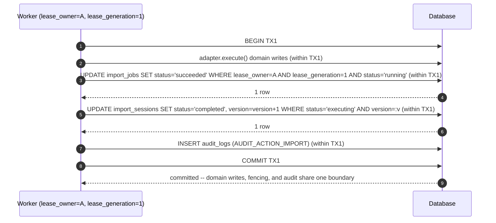
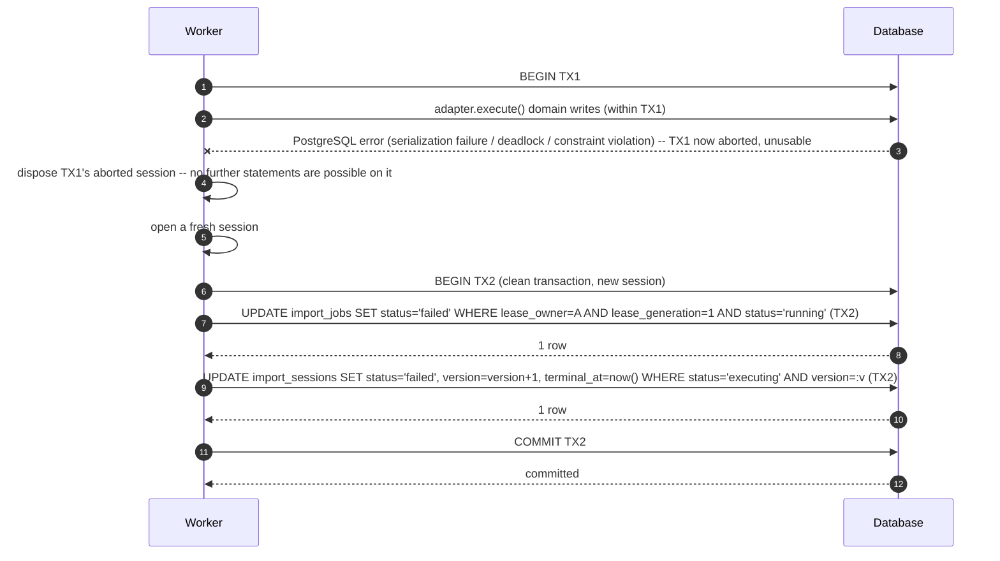
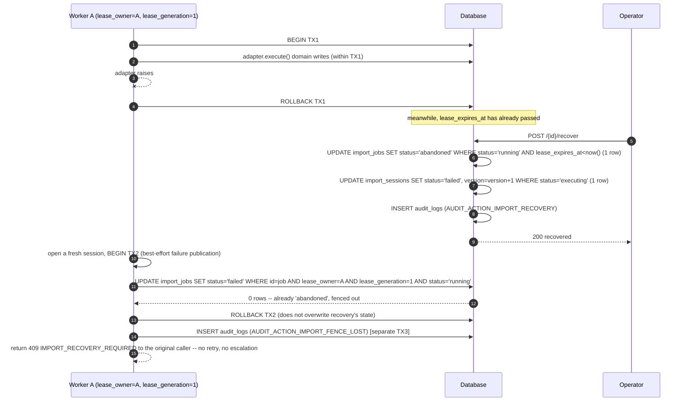

# Roadmap PR19A — Legacy Import Foundation: Design Specification

**Status:** Design only. No runtime code, migration, API, or test file is part of this PR. Nothing in this document has been implemented.
**Repository:** Medical Equipment Pool. Not MEMS, not Recall Monitor.
**Baseline:** `729d1aa2f40db60a6056ecbb5bc1ab8e64e92e52` — Roadmap PR18 is fully merged and governance-synced at this commit. This design branches directly from that commit.
**Scope authority:** `docs/audits/04-consolidated-implementation-plan.md` Part D, Group 8, "PR19 — Legacy Import Foundation."
**Supersedes:** PR #81, already closed unmerged (bundled this design with implementation, a process violation).
**Provenance (for audit trail only — every section below is self-contained and does not require reading any of this history to implement):** five prior revisions on this same PR resolved successive independent-review rounds. This document is the complete, authoritative specification as of the current revision; an implementer needs nothing beyond what follows.

---

## 1. Objective

Specify the complete backend architecture for eventually importing historical AppSheet data (Equipment master, Receive history, Issue history) into this system, such that PR19A1–PR19A3 can be implemented without consulting any prior document, review comment, or revision. No parser, no legacy data import, and no UI are in scope (§26).

---

## 2. Inputs Reviewed

| Area | Source | What it established |
|---|---|---|
| Roadmap scope | `docs/audits/04-consolidated-implementation-plan.md` Part D, Group 8 | PR19 is architecture only. |
| Engineering process | `docs/ENGINEERING_WORKFLOW.md` §6 | A Design PR must define API proposal, data model, security boundaries, risks, acceptance criteria, and slices before implementation. |
| Prior import precedent | Roadmap PR12 | Bounded row count, bulk-lookup validation, safe generic error wrapping, Administrator-only gate, `ge=1` pagination, bounded decompressed-archive size — reused directly. |
| Schema-hygiene precedent | Migrations `0013`/`0014` | "Verify → classify → transform/no-op/fail-closed"; explicit `ON DELETE RESTRICT` everywhere. |
| Timestamp policy precedent | Roadmap PR15B (migration `0012`) | Every persisted timestamp is `TIMESTAMPTZ`, UTC-stored. |
| RBAC precedent | `backend/app/api/v1/deps.py`, `docs/BUSINESS_RULES.md` | Confirmed 3-role model: Administrator, Equipment Pool Staff, Read Only. `ADMINISTRATOR_ONLY_ROLES` reused, no new role. |
| PostgreSQL claim pattern | `SELECT ... FOR UPDATE SKIP LOCKED` | Standard idiom for safe concurrent batch-claiming without inventing a bespoke locking protocol — used by retention cleanup (§18). |
| Owner Decision | Recorded in `docs/DECISION_LOG.md` | Data retention policy: 180 days post-terminal, redact-in-place, deployment-configurable period, no V1 Administrator UI. |

---

## 3. Domain Model Contract

Conceptual entity model. The literal physical schema is §4; the public API vocabulary is §21.

### 3.1 ImportSession

*(persisted as `import_sessions`)* — one staged import attempt for one dataset type; the root aggregate of the pipeline. Owned by `created_by_user_id` (the Administrator who created it). Carries the session's own lifecycle status (§5), an optimistic-concurrency `version` counter (§7), and retention bookkeeping (§18). Relationships: 1:1 `ImportSource` (§3.2); 1:N `ImportJob` (§3.3). Sensitive fields: `notes` (operator free text), `failure_reason` (bounded, generic). Retention: §18, anchored on `terminal_at`.

### 3.2 ImportSource

*(persisted as `import_sources`)* — the single source-of-truth identity/checksum record for a session's data. Carries its own two-state lifecycle (`registered`/`frozen`, §6) that gates when validation may begin. Does not store raw bytes in this foundation (§9.1's forward-reference note — no code in PR19A1–A3 stores or re-reads source bytes; deferred to a future concrete-adapter slice). Sensitive fields: `filename`. Retention: descriptive fields redacted post-retention; `checksum` retained (§18).

### 3.3 ImportJob — backing entity for ValidationAttempt / DryRunAttempt / ExecutionAttempt

*(persisted as `import_jobs`; public API concept names: `ValidationAttempt`, `DryRunAttempt`, `ExecutionAttempt` — one physical table, discriminated by `job_type`)* — one execution record of one phase. Carries the fencing token set (`lease_owner`, `lease_generation`, §9) that protects its completion write from a late/superseded commit. Sensitive fields: `error_message` (bounded, generic, retained post-retention).

**Why one table, not three:** the three domain concepts share an identical shape and lifecycle. Splitting them adds schema surface with no behavioral difference, contrary to this slice's foundation-only scope.

### 3.4 ValidationFinding

*(persisted as `import_row_errors`)* — one collected finding, attributed to a `ValidationAttempt` via `import_job_id`. Sensitive fields: `message`/`field` (may echo raw legacy source values). Retention: redacted post-retention; structural fields (`error_code`/`severity`/`row_number`) retained so aggregate counts stay reconcilable.

### 3.5 ImportAuditEvent — integration with the existing audit log

Not a new table. Four action constants on the existing `audit_logs` table (`entity_type = AUDIT_ENTITY_IMPORT_SESSION`): `AUDIT_ACTION_IMPORT` (execute success), `AUDIT_ACTION_IMPORT_RECOVERY` (lease-expiry recovery claim, §9), `AUDIT_ACTION_IMPORT_FENCE_LOST` (a superseded worker's commit — either a job completion or a retention-cleanup completion — was correctly discarded, §9/§18; one constant, reused across both contexts since they are the same event conceptually), `AUDIT_ACTION_IMPORT_RETENTION_CLEANUP` (one entry per session purged, §18). No schema change to `audit_logs` itself.

### 3.6 No source-storage reference table

Not part of this foundation's schema. No code in PR19A1–A3 stores or re-reads raw source bytes; a future concrete-adapter slice introduces its own storage-reference schema when it needs one.

---

## 4. Physical Schema Contract

Every table this feature introduces, exact and complete. Internal persistence only — §21 is the public API vocabulary. Conventions applied uniformly: every enum-shaped column is a plain `VARCHAR` with a named `CHECK` constraint (`native_enum=False`, `create_constraint=True` on the ORM side, §8); every timestamp is `TIMESTAMPTZ`; every foreign key is `ON DELETE RESTRICT`; UUIDs are application-generated.

### 4.1 `import_sessions`

| Column | Type | Null | Default | Notes |
|---|---|---|---|---|
| `id` | UUID | NOT NULL | app-generated | PK |
| `dataset_type` | VARCHAR(100) | NOT NULL | — | |
| `status` | VARCHAR(30) | NOT NULL | `'created'` | `CHECK` — 11 values, §5 |
| `version` | INTEGER | NOT NULL | `0` | Optimistic-concurrency counter — incremented by exactly 1 on every CAS-guarded `UPDATE` to this row (§7). Not a substitute for the `status`-based CAS predicate; an additional, independent check |
| `created_by_user_id` | UUID | NOT NULL | — | FK → `users.id` RESTRICT |
| `idempotency_key` | VARCHAR(200) | NULL | — | |
| `notes` | TEXT | NULL | — | `CHECK char_length(notes) <= 4000`; redacted post-retention |
| `current_validation_job_id` | UUID | NULL | — | Composite FK → `import_jobs (import_session_id, id)`, §4.5 |
| `validated_at`, `dry_run_completed_at`, `executed_at` | TIMESTAMPTZ | NULL | — | |
| `terminal_at` | TIMESTAMPTZ | NULL | — | Retention-clock anchor (§18); set only for `COMPLETED`/`FAILED`/`CANCELLED` |
| `retention_purged_at` | TIMESTAMPTZ | NULL | — | Retention-cleanup idempotency guard — **database PII redaction only**, distinct from `source_bytes_deleted_at` below (§18) |
| `source_bytes_deleted_at` | TIMESTAMPTZ | NULL | — | Durable source-object deletion marker, observable/auditable independently of `retention_purged_at` (§18). Always NULL until set by the retention-cleanup transaction |
| `retention_cleanup_claimed_by` | UUID | NULL | — | Retention-cleanup claim token (§18) |
| `retention_cleanup_claim_expires_at` | TIMESTAMPTZ | NULL | — | Retention-cleanup claim staleness bound (§18) |
| `total_rows`, `valid_rows`, `invalid_rows`, `warning_rows`, `imported_rows` | INTEGER | NULL | — | |
| `failure_reason` | TEXT | NULL | — | `CHECK char_length(failure_reason) <= 2000`; retained post-retention |
| `created_at`, `updated_at` | TIMESTAMPTZ | NOT NULL | `now()` | |

**Keys/constraints:** PK `id`. `UNIQUE (dataset_type, idempotency_key)`. Composite FK `(id, current_validation_job_id)` → `import_jobs (import_session_id, id)`, `MATCH SIMPLE`, `ON DELETE RESTRICT` (§4.5). `INDEX (dataset_type, status)`. `INDEX (created_by_user_id)`. `INDEX (terminal_at)`. `INDEX (retention_cleanup_claim_expires_at) WHERE retention_purged_at IS NULL` (supports the cleanup claim query, §18).

**Session creation carries no identity/checksum field** — `POST /import-sessions` accepts only `{dataset_type, idempotency_key?, notes?}` (§15). No `idempotency_fingerprint`-style column exists on this table; `(dataset_type, idempotency_key)` uniqueness is sufficient on its own, since there is no other identity-bearing field at creation time.

### 4.2 `import_sources`

| Column | Type | Null | Default | Notes |
|---|---|---|---|---|
| `id` | UUID | NOT NULL | app-generated | PK |
| `import_session_id` | UUID | NOT NULL | — | FK → `import_sessions.id` RESTRICT, `UNIQUE` |
| `status` | VARCHAR(20) | NOT NULL | `'registered'` | `CHECK status IN ('registered', 'frozen')` — the source lifecycle, §6 |
| `version` | INTEGER | NOT NULL | `0` | Optimistic-concurrency counter, incremented by exactly 1 on every CAS-guarded `UPDATE` to this row — correction (§15.2) and freeze (§6) both contend on this same column, mirroring `import_sessions.version` (§7) |
| `frozen_at` | TIMESTAMPTZ | NULL | — | Set exactly once, atomically with the session's first `CREATED → VALIDATING` transition (§6, §7) |
| `checksum` | VARCHAR(128) | NOT NULL | — | `CHECK char_length(checksum) >= 32`; correctable via CAS while `status='registered'`, immutable once `status='frozen'` (§6, §15); retained post-retention |
| `byte_size` | BIGINT | NOT NULL | — | Part of the identity fingerprint (§15) |
| `content_type` | VARCHAR(255) | NULL | — | Redacted post-retention |
| `filename` | VARCHAR(255) | NULL | — | Redacted post-retention |
| `source_version` | VARCHAR(100) | NULL | — | Caller-supplied source "vintage" marker |
| `options_fingerprint` | VARCHAR(64) | NOT NULL | — | SHA-256 hex of normalized options; defaults to the hash of `{}` (this foundation has no options fields yet) |
| `source_fingerprint` | VARCHAR(64) | NOT NULL | — | Full composite identity hash, §15 |
| `created_at` | TIMESTAMPTZ | NOT NULL | `now()` | |

**Keys/constraints:** PK `id`. `UNIQUE (import_session_id)`. `INDEX (checksum)`. FK `import_session_id` → `import_sessions.id` RESTRICT.

### 4.3 `import_jobs`

| Column | Type | Null | Default | Notes |
|---|---|---|---|---|
| `id` | UUID | NOT NULL | app-generated | PK |
| `import_session_id` | UUID | NOT NULL | — | FK → `import_sessions.id` RESTRICT |
| `job_type` | VARCHAR(20) | NOT NULL | — | `CHECK job_type IN ('validate','dry_run','execute')` |
| `status` | VARCHAR(20) | NOT NULL | `'pending'` | `CHECK status IN ('pending','running','succeeded','failed','abandoned')` — `'abandoned'` marks a lease-expiry recovery, distinct from a genuine `'failed'` outcome |
| `attempt_number` | INTEGER | NOT NULL | — | Monotonic per `(import_session_id, job_type)` |
| `lease_owner` | UUID | NULL | — | Fencing token, part 1: identifies which acquisition holds the lease (§9) |
| `lease_generation` | INTEGER | NOT NULL | `1` | Fencing token, part 2: a monotonically increasing counter, forward-compatible with a hypothetical future in-place lease re-acquisition. **In this foundation it is always `1`** — a new attempt is always a new `import_jobs` row (never a re-lease of an existing row), so this column has no observable variation yet; it exists so a completion-fencing check never needs to change shape if that assumption is ever revisited (§9) |
| `lease_expires_at` | TIMESTAMPTZ | NULL | — | `now() + IMPORT_JOB_LEASE_DURATION_SECONDS` (default 300s) at acquisition and at every successful renewal (§9) |
| `heartbeat_at` | TIMESTAMPTZ | NULL | — | Last successful renewal timestamp (observability) |
| `started_at`, `finished_at` | TIMESTAMPTZ | NULL | — | |
| `error_message` | TEXT | NULL | — | `CHECK char_length(error_message) <= 2000`; retained post-retention |
| `ruleset_version` | VARCHAR(50) | NULL | — | VALIDATE jobs only, §13 |
| `created_at` | TIMESTAMPTZ | NOT NULL | `now()` | |

**Keys/constraints:** PK `id`. FK `import_session_id` → `import_sessions.id` RESTRICT. `UNIQUE (import_session_id, id)` (composite-FK target, §4.5). `UNIQUE (import_session_id, job_type, attempt_number)`. `INDEX (import_session_id, job_type)`. `INDEX (lease_expires_at) WHERE status = 'running'` (recovery-claim scan, §9).

### 4.4 `import_row_errors` (ValidationFinding)

| Column | Type | Null | Default | Notes |
|---|---|---|---|---|
| `id` | UUID | NOT NULL | app-generated | PK |
| `import_job_id` | UUID | NOT NULL | — | FK → `import_jobs.id` RESTRICT |
| `row_number` | INTEGER | NULL | — | |
| `field` | VARCHAR(100) | NULL | — | Redacted post-retention |
| `error_code` | VARCHAR(100) | NOT NULL | — | Retained post-retention |
| `message` | TEXT | NOT NULL | — | Redacted post-retention (replaced with a fixed placeholder — `NOT NULL` is preserved, never a real `NULL`) |
| `severity` | VARCHAR(10) | NOT NULL | `'error'` | `CHECK severity IN ('error','warning')` |

**Keys/constraints:** PK `id`. FK `import_job_id` → `import_jobs.id` RESTRICT. `INDEX (import_job_id, row_number)`.

### 4.5 The composite validation-ownership foreign key

```sql
ALTER TABLE import_jobs
  ADD CONSTRAINT uq_import_jobs_session_id UNIQUE (import_session_id, id);

ALTER TABLE import_sessions
  ADD CONSTRAINT fk_import_sessions_current_validation_job
  FOREIGN KEY (id, current_validation_job_id)
  REFERENCES import_jobs (import_session_id, id)
  ON DELETE RESTRICT;
```

**Why:** a plain single-column `FOREIGN KEY (current_validation_job_id) REFERENCES import_jobs(id)` only proves the referenced job exists somewhere — nothing stops it from pointing at a job belonging to a *different* session. The composite FK requires the tuple `(session.id, session.current_validation_job_id)` to match a row where `import_jobs.import_session_id = session.id` **and** `import_jobs.id = session.current_validation_job_id` simultaneously — ownership enforced by the database, not only by application code.

**Null behavior:** `MATCH SIMPLE` (PostgreSQL's default) — the constraint is not evaluated while `current_validation_job_id IS NULL` (a session with no successful validation attempt yet).

**Downgrade order:** drop `fk_import_sessions_current_validation_job` first, then `uq_import_jobs_session_id`.

### 4.6 Schema-convergence matrix

The objects most likely to diverge between the ORM fresh-install path and the Alembic historical-upgrade path if not carefully implemented — §8's PostgreSQL tests must assert convergence for each:

| Object | ORM fresh-create source | Migration historical-upgrade source | Convergence requirement |
|---|---|---|---|
| `ck_import_sessions_status` | `_StrEnum(..., create_constraint=True)` | Raw SQL `CHECK` in `CREATE TABLE` | Identical `pg_get_constraintdef()` |
| `ck_import_sources_status` | Same | Same | Identical |
| `ck_import_jobs_status` (incl. `'abandoned'`) | Same | Same | Identical |
| `ck_import_jobs_job_type` | Same | Same | Identical |
| `ck_import_row_errors_severity` | Same | Same | Identical |
| `uq_import_jobs_session_id` `(import_session_id, id)` | `UniqueConstraint` in `__table_args__` | Raw SQL `ADD CONSTRAINT ... UNIQUE` | Identical column order |
| `fk_import_sessions_current_validation_job` (composite) | `ForeignKeyConstraint` in `__table_args__` | Raw SQL `ADD CONSTRAINT ... FOREIGN KEY` | Identical referenced columns, `MATCH SIMPLE`, `ON DELETE RESTRICT` |
| `uq_import_jobs_session_job_type_attempt` | `UniqueConstraint` | Raw SQL | Identical |
| `ix_import_jobs_lease_expires_at` (partial, `WHERE status='running'`) | `Index(..., postgresql_where=...)` | Raw SQL partial index | Identical predicate text |
| `ix_import_sessions_retention_cleanup_claim` (partial, §4.1) | Same pattern | Same | Identical predicate text |

All schema convergence testing, for every table and every column regardless of which slice later reads or writes it, is entirely **PR19A1's** testing responsibility (§25) — a column a later slice merely *uses* (e.g. `lease_owner`, `version`) was still *created* by PR19A1's migration.

---

## 5. Import Session Lifecycle

```
CREATED
VALIDATING
VALIDATED
VALIDATION_FAILED
DRY_RUN_RUNNING
DRY_RUN_COMPLETED
DRY_RUN_FAILED
EXECUTING
COMPLETED
FAILED
CANCELLED
```

Deliberately **not** related to equipment lifecycle states, a separate domain.

| From | Trigger | To |
|---|---|---|
| `CREATED` | validate — accepts a `SOURCE_REGISTERED` source and atomically freezes it as part of validation admission (§6) | `VALIDATING` |
| `VALIDATING` | (internal) | `VALIDATED` \| `VALIDATION_FAILED` |
| `VALIDATED` | re-validate | `VALIDATING` |
| `VALIDATION_FAILED` | re-validate | `VALIDATING` |
| `VALIDATED` | dry-run | `DRY_RUN_RUNNING` |
| `DRY_RUN_RUNNING` | (internal) | `DRY_RUN_COMPLETED` \| `DRY_RUN_FAILED` |
| `DRY_RUN_COMPLETED` | re-dry-run | `DRY_RUN_RUNNING` |
| `DRY_RUN_FAILED` | re-dry-run | `DRY_RUN_RUNNING` |
| `DRY_RUN_COMPLETED` | execute | `EXECUTING` |
| `EXECUTING` | (internal) | `COMPLETED` \| `FAILED` |
| `{CREATED, VALIDATED, VALIDATION_FAILED, DRY_RUN_COMPLETED, DRY_RUN_FAILED}` | cancel | `CANCELLED` |

**Terminal states:** `COMPLETED`/`FAILED`/`CANCELLED` — the only three that set `terminal_at` (§18). `VALIDATION_FAILED`/`DRY_RUN_FAILED` are **not** terminal (re-validate/re-dry-run remain possible). A `FAILED` execution never auto-retries — a fresh dry-run is required first.

---

## 6. Source Lifecycle

**Required invariant:** validation may only begin against a source that can never again change. This is enforced as an explicit, immutable two-state lifecycle on `ImportSource` (§4.2), gating the session's own `CREATED → VALIDATING` transition.

```mermaid
stateDiagram-v2
    [*] --> NEW: session created, no ImportSource row yet
    NEW --> SOURCE_REGISTERED: POST /{id}/source (first call)
    SOURCE_REGISTERED --> SOURCE_REGISTERED: POST /{id}/source (correction — a differing fingerprint overwrites; identical is a no-op)
    SOURCE_REGISTERED --> SOURCE_FROZEN: first successful POST /{id}/validate — system-performed, atomic with the session's CREATED to VALIDATING transition
    SOURCE_FROZEN --> SOURCE_FROZEN: further POST /{id}/source — 200 no-op if identical, 409 IMPORT_SOURCE_MISMATCH if differing; never mutates
    note right of SOURCE_FROZEN
        Irreversible. No transition ever leaves this state
        for the life of the session. Every subsequent
        validate / dry-run / execute attempt, and every
        re-validate / re-dry-run, operates against this
        exact, unchanging ImportSource row.
    end note
```

**States:**
- **`NEW`** — implicit (no `ImportSource` row exists). Not a stored value.
- **`SOURCE_REGISTERED`** (`import_sources.status = 'registered'`) — a source has been registered via `POST /{id}/source`, but no validation has ever started. **Corrections are allowed** in this state: a subsequent registration call with a *differing* identity fingerprint (§15) **overwrites** the row (an operator may fix a mistaken registration before committing to it) — an identical fingerprint is an idempotent no-op, as always.
- **`SOURCE_FROZEN`** (`import_sources.status = 'frozen'`, `frozen_at` set) — set exactly once, **who:** the system, automatically, never a distinct manual action or endpoint; **when:** atomically with the session's *first* successful `CREATED → VALIDATING` transition (one transaction, §7); **reversible:** no, never, for the life of the session.

**Single authoritative admission rule (stated once, applies everywhere in this document):** validate accepts a source in state `SOURCE_REGISTERED` and atomically freezes it as part of validation admission. Validation work begins only after the freeze transaction commits. Every reference to source freezing elsewhere in this document (§5, §21, §24, §27) restates this same rule; there is no second, conflicting reading anywhere.

**Validation gate:** `POST /{id}/validate` first checks that an `ImportSource` row exists at all — if none, the endpoint fails immediately with `409 IMPORT_SOURCE_NOT_REGISTERED` (§23), before any CAS transition is attempted. If a row exists (in either `registered` or `frozen` state), the freeze contract below runs.

**Freeze contract:**

- **Requires:** `import_sources.status = 'registered'` for the target session. A row already `'frozen'` takes the idempotent-no-op branch below; a session with no row at all was already rejected by the validation gate above.
- **Verifies durable source bytes and checksum:** not applicable in this foundation — no code in PR19A1–A3 stores or re-reads raw source bytes (§3.2, §3.6); there is nothing to verify against yet. A future concrete-adapter slice that adds byte storage must add this verification step to the freeze contract at that time, before the `UPDATE` below.
- **Computes/finalizes the immutable fingerprint:** `source_fingerprint` was already computed at registration/correction time (§15.2); freeze does not recompute it — freeze's only effect on identity is to make the already-computed value permanent by making the row itself immutable going forward.
- **Increments `version`:** yes, `version = version + 1`, in the same `UPDATE` that sets `status = 'frozen'` — this is the same column, and the same CAS discipline, that source correction (§15.2) also writes through, so freeze and correction structurally contend on one predicate.
- **Changes source to `SOURCE_FROZEN`:** `status = 'frozen'`, `frozen_at = now()`.
- **Prevents all future source-content corrections:** not via a separate trigger or constraint — every code path in this design that writes to `import_sources`' identity columns (`checksum`, `byte_size`, `content_type`, `filename`, `source_version`, `options_fingerprint`, `source_fingerprint`) is the single correction `UPDATE` in §15.2, and that statement's own `WHERE status = 'registered'` predicate makes it structurally incapable of touching a frozen row. No other `UPDATE` statement anywhere in this design touches those columns, so no trigger is required for this guarantee to hold.
- **Executed as part of validate admission when the source is still `SOURCE_REGISTERED`** — the sole authoritative behavior (the admission rule above); there is no separate, explicit freeze endpoint or manual operator action.

**Freeze-and-transition (one transaction):**

```sql
-- Idempotent no-op once already frozen; only takes effect the first time.
UPDATE import_sources
SET status = 'frozen', frozen_at = now(), version = version + 1
WHERE import_session_id = :session_id AND status = 'registered';

-- The session's own CAS transition, §7, in the SAME transaction.
UPDATE import_sessions
SET status = 'validating', version = version + 1, updated_at = now()
WHERE id = :session_id AND status = ANY(:allowed_from_statuses) AND version = :expected_version
RETURNING id, version;
```

Both statements commit or roll back together. On re-validate (the second, third, ... call), the first statement affects zero rows (already `'frozen'`) — harmless, not an error; the session's own CAS still governs whether the re-validate itself is permitted. Because this `UPDATE`'s `WHERE` clause is evaluated atomically by PostgreSQL as part of the statement itself — never preceded by a separate `SELECT` that a concurrent correction (§15.2) could race against — freeze and correction can never observe or act on a stale read of each other's state; exactly one of them ever wins a given moment's `status = 'registered'` window (§15.2 restates this from the correction side).

**Forbidden transitions:** registering a source (`POST /{id}/source`) after `SOURCE_FROZEN` with a differing fingerprint is rejected using the same `409 IMPORT_SOURCE_MISMATCH` error code defined in §15 — the row is never mutated once frozen, regardless of whether the differing attempt is well-intentioned. There is no endpoint or mechanism anywhere in this design that un-freezes a source.

**Why execution necessarily uses the identical frozen source that produced the accepted validation snapshot:** `ImportSource` is 1:1 with its session and, once frozen, immutable for that session's entire remaining lifetime. Since dry-run and execute can only be reached after a session has passed through `VALIDATING` at least once (§5), and freezing is an unconditional, irreversible side effect of that first `VALIDATING` transition, every later phase transaction necessarily observes the exact same `ImportSource` row — there is no code path, in this design, by which a session could ever have two different "versions" of its source across its lifetime.

---

## 7. Atomic Transition and Concurrency Policy

Every state-changing operation on `import_sessions` is a single, atomic conditional `UPDATE`, never a load-then-mutate-then-commit sequence:

```sql
UPDATE import_sessions
SET status = :new_status, version = version + 1, updated_at = now()
WHERE id = :session_id AND status = ANY(:allowed_from_statuses) AND version = :expected_version
RETURNING id, version;
```

executed via SQLAlchemy Core. `:expected_version` is the value the caller most recently observed for this session (read via `RETURNING version` from whichever prior call last touched it — session creation, the previous phase's own transition, etc.). Every guarded `UPDATE` increments `version` by exactly 1 and returns the new value.

**Two independent guards, not one:** `status = ANY(:allowed_from_statuses)` (the finite-state-machine guard, §5) and `version = :expected_version` (a general-purpose optimistic-concurrency guard, independent of what changed). The `status` guard alone is normally sufficient for the transitions §5 defines, since every transition names its exact required source states; `version` is an additional, independent safety net that does not rely on interpreting `status` correctly, and is required by completion fencing (§9) as a second, session-level fence alongside the job-level `lease_owner`/`lease_generation` fence.

Zero rows affected on any such `UPDATE` means the caller lost a race, or the session is genuinely in the wrong state — it must re-fetch and respond per §9 (fencing/recovery) or §23 (error codes), never proceed as if it had won.

**Why compare-and-set, not `SELECT ... FOR UPDATE`:** the two-step-commit strategy (§9) commits durably after step 1 ("phase started") before step 2 ("do the work") begins; a row lock taken in step 1 releases at that commit and provides no protection for the gap before step 2. Compare-and-set needs no cross-step lock.

**Session creation's own race-safety:** `get_or_create_session()`'s `INSERT`-then-possible-`UNIQUE`-violation is resolved by catching the `IntegrityError`, rolling back, and re-querying by `(dataset_type, idempotency_key)` — unrelated to the `version` counter, since a not-yet-created row has none.

---

## 8. Fresh-Install / Historical-Upgrade Schema Convergence

1. `_StrEnum()` passes `create_constraint=True` so the ORM-driven fresh-install path (`Base.metadata.create_all()`) emits a named `CHECK` constraint identical to the migration's.
2. The migration applies a **verify → classify → transform / no-op / fail-closed** pattern (the same one migrations `0013`/`0014` established) to every table this feature introduces, comparing full catalog definitions (`pg_get_constraintdef()`, index definitions, column defaults/nullability) — never ORM metadata alone, and never treating "a table with this name already exists" as success without verification.

**Acceptance criteria (PR19A1 must prove with PostgreSQL tests):** a fresh empty database upgraded directly to head, and a database upgraded historically through the pre-existing migration chain then to head, produce byte-identical definitions for every object in §4.6. Downgrade → re-upgrade round-trip reproduces the same converged state. A deliberately mismatched pre-existing table causes the migration to fail closed.

---

## 9. Recovery Contract

This section is authoritative for lease acquisition, heartbeat renewal, expiry, the recovery claim, completion fencing on both the success and failure paths, and every failure mode this design accounts for. The mechanism is generic across `job_type` throughout — nothing below hardcodes `validate`, `dry_run`, or `execute` specifically, only a small per-`job_type` mapping to session-status values (§25 assigns building this mechanism, and applying it to `VALIDATING`, to PR19A2; PR19A3 reuses it unchanged for `DRY_RUN_RUNNING`/`EXECUTING`).

### 9.1 Lease acquisition

Every phase-starting transition into a `*_RUNNING` status (`VALIDATING`, `DRY_RUN_RUNNING`, `EXECUTING`) creates a new `import_jobs` row and, in the same transaction as §7's session CAS, sets:

```sql
INSERT INTO import_jobs (
  id, import_session_id, job_type, status, attempt_number,
  lease_owner, lease_generation, lease_expires_at, heartbeat_at, started_at
) VALUES (
  :job_id, :session_id, :job_type, 'running',
  (SELECT COALESCE(MAX(attempt_number), 0) + 1 FROM import_jobs
     WHERE import_session_id = :session_id AND job_type = :job_type),
  :fresh_lease_owner_uuid, 1, now() + :lease_duration, now(), now()
);
```

`attempt_number`'s computation is race-safe because only the caller that already won the session's own CAS (§7) ever reaches this `INSERT` — there is exactly one winner per phase attempt.

### 9.2 Heartbeat and renewal

This foundation's phases run synchronously within one HTTP request. Renewal is a background `asyncio.create_task`, started immediately after lease acquisition, running concurrently with the phase's real work (the off-thread parse, the validation loop, `plan_dry_run`, or `execute`), and cancelled in a `finally` block once that work completes:

```python
async def _renew_lease_loop(session_factory, job_id, lease_owner, lease_generation):
    consecutive_transient_failures = 0
    while True:
        await asyncio.sleep(IMPORT_JOB_HEARTBEAT_INTERVAL_SECONDS)
        try:
            async with session_factory() as db:   # a session of its OWN — never
                result = await db.execute(          # shared with the main work's session;
                    update(ImportJob)                # AsyncSession is not safe for concurrent
                    .where(ImportJob.id == job_id,    # use from two coroutines
                           ImportJob.lease_owner == lease_owner,
                           ImportJob.lease_generation == lease_generation,
                           ImportJob.status == "running")
                    .values(lease_expires_at=func.now() + IMPORT_JOB_LEASE_DURATION,
                            heartbeat_at=func.now())
                    .returning(ImportJob.id)
                )
                await db.commit()
        except (OSError, DBAPIError):
            # transient: cannot distinguish "DB unreachable" from "lease reassigned"
            consecutive_transient_failures += 1
            if consecutive_transient_failures >= 3:
                return  # give up; completion fencing (§9.4) is the real backstop
            continue
        consecutive_transient_failures = 0
        if result.first() is None:
            return  # clean 0-row response: definitely lost the lease -- stop immediately,
                     # no retry (unlike the transient-exception case above)
```

`IMPORT_JOB_HEARTBEAT_INTERVAL_SECONDS` defaults to 60s, `IMPORT_JOB_LEASE_DURATION_SECONDS` to 300s (both deployment-configurable) — a 5× safety margin so a single missed renewal does not immediately produce a false-positive recovery. A **clean** zero-row result (the `UPDATE`'s `WHERE` clause matched no row) is treated as an immediate, unambiguous "lease lost" signal — stop retrying. A **raised exception** (network/DB error) is treated as transient and retried up to two more times before giving up, because a raised exception alone cannot distinguish "the database is temporarily unreachable" from "the lease has been reassigned."

The renewal loop's own success or failure to notice it lost the lease is **only ever an early-warning / best-effort signal**. The actual safety guarantee against a late commit is completion fencing (§9.4), which works correctly even if the renewal loop never detects anything wrong.

### 9.3 Lease expiry and the recovery claim

A job is *stale-running* when `status = 'running'` and `lease_expires_at < now()`. Recovery is a dedicated, mutating, Administrator-only operation — **never** a side effect of any `GET` request, and never silently performed by any other mutating endpoint either (§21):

```sql
-- Step 1: atomically claim the expired lease.
UPDATE import_jobs
SET status = 'abandoned', finished_at = now(),
    error_message = 'stale: lease expired, process interruption presumed'
WHERE id = :job_id AND status = 'running' AND lease_expires_at < now()
RETURNING id;

-- Step 2 (same transaction, only if step 1 affected a row): transition the owning session.
UPDATE import_sessions
SET status = :failure_status_for_this_phase, version = version + 1,
    failure_reason = 'recovered: prior attempt abandoned after lease expiry',
    terminal_at = CASE WHEN :failure_status_for_this_phase = 'failed' THEN now() ELSE terminal_at END,
    updated_at = now()
WHERE id = :session_id AND status = :running_status_for_this_phase
RETURNING id;
```

If either statement affects zero rows, the **entire transaction rolls back** — recovery is a safe no-op, not an error (someone else already resolved it, or the session moved on for another reason). `terminal_at` is set only when the phase's failure status is itself terminal (`EXECUTING → FAILED`); `VALIDATION_FAILED`/`DRY_RUN_FAILED` are not terminal (§5), so recovering `VALIDATING`/`DRY_RUN_RUNNING` never sets it. One `AUDIT_ACTION_IMPORT_RECOVERY` entry is written in the same transaction (§3.5).

**No automatic retry, ever.** Per §5, `*_FAILED` never auto-retries. An operator must explicitly trigger the next phase, creating a genuinely new `import_jobs` row with an incremented `attempt_number` — recovery only closes out the abandoned attempt honestly, never opens a new one.

**Response contract:** a genuine recovery returns the now-`*_FAILED` session, `200`. Nothing to recover (session already terminal, or its lease has not expired) returns `409 IMPORT_SESSION_INVALID_STATE`.

**Other mutating endpoints never silently recover.** If `validate`/`dry-run`/`execute`/`cancel` is called against a stale-running session, the endpoint performs no mutation of its own and returns `409 IMPORT_RECOVERY_REQUIRED` — the caller must call `/recover` first.

### 9.4 Completion fencing — success and failure paths, both

Every phase execution follows one explicit transaction-boundary contract, from lease acquisition (§9.1) to completion. The contract is different for the success path (§9.4.1) and the failure path (§9.4.2), but both are fenced identically on `lease_owner` + `lease_generation` + `session.version`, and both guarantee the same outcome: **a merely-slow-but-alive worker's own completion write is structurally incapable of committing once superseded** — the fencing check and the commit are the same atomic operation, so a job can be safely recovered the instant its lease appears expired, without first proving the original process is truly dead.

**A crashed job leaves nothing to fence — only a real completion attempt does.** If a worker never reaches either §9.4.1 or §9.4.2 (process death, network partition, statement timeout — §9.5's failure-mode table), there is no completion write to fence in the first place; the job simply stays `'running'` until recovery (§9.3) claims it. Fencing exists to protect the case where a worker *does* eventually attempt to complete, but has already been superseded.

#### 9.4.1 Success path — one transaction, start to finish

A phase's real, durable domain writes and its fenced success publication share exactly one commit boundary. There is no window in which domain data is committed but completion is not, or vice versa.

1. The lease is already held (§9.1); `lease_owner`, `lease_generation`, and the session's `version` observed at acquisition time are held in memory for the remainder of the request — not re-read from the database later.
2. One database transaction (`TX1`) is opened for the entirety of the phase's domain work.
3. Adapter/domain work executes inside `TX1` — for `EXECUTING`, `adapter.execute()`'s writes; for `VALIDATING`, the `ValidationFinding` rows and job/session counters (§12). **A validation pass that runs to completion and finds blocking errors is still success for job-completion purposes** — the job's own status is `'succeeded'` regardless of whether the session's resulting status is `VALIDATED` or `VALIDATION_FAILED` (§12); only a genuine crash during parsing/validation is the failure path below.
4. The fenced success publication — both `UPDATE`s below — runs inside the **same** `TX1`, after the domain work, before any commit:

```sql
-- Job-level fence:
UPDATE import_jobs
SET status = 'succeeded', finished_at = now(), error_message = NULL
WHERE id = :job_id
  AND lease_owner = :my_lease_owner
  AND lease_generation = :my_lease_generation
  AND status = 'running'
RETURNING id;

-- Session-level fence, same transaction:
UPDATE import_sessions
SET status = :new_status, version = version + 1, updated_at = now(), ...
WHERE id = :session_id AND status = :running_status AND version = :my_observed_version
RETURNING id;
```

5. For `execute` specifically, the `AUDIT_ACTION_IMPORT` entry (§19) is written inside this **same** `TX1`, alongside the domain write and both fencing `UPDATE`s — one commit boundary covers the domain write, the job completion, the session completion, and the audit entry: all four commit together, or none do.
6. **`TX1` commits only if every statement in it — the domain work and both fencing `UPDATE`s — succeeded** (each fencing `UPDATE` affected exactly one row). If either fencing `UPDATE` affects zero rows, `TX1` is rolled back in its entirety before it ever reaches commit, **discarding the domain writes along with the failed fencing check** — the worker has been fenced out, and this attempt now follows the failure path below (§9.4.2) to record that outcome, never a partial or forced commit.

#### 9.4.2 Failure path — rollback, then a clean fenced transaction

Failure covers both a raised Python/domain exception and a PostgreSQL-level error (constraint violation, serialization failure, deadlock, or a lost §9.4.1 fencing check). The two are handled identically from this point on, because a PostgreSQL error leaves the transaction in an unusable, already-aborted state exactly as if the application had triggered the rollback itself.

1. **`TX1` is rolled back.** No adapter or domain write from `TX1` survives — it was never committed. If PostgreSQL itself aborted `TX1` (a database-level error, not an application-raised exception), the connection/session is already unusable for further statements; the application does not attempt to reuse it, whether or not it also issues an explicit `ROLLBACK`.
2. **`TX1`'s session is disposed, never reused for what follows.** A fresh `AsyncSession` is opened for step 3 — the same "never share a session across two logical transactions" discipline §9.2's renewal loop already follows for its own, unrelated session.
3. **A brand-new, clean transaction (`TX2`) attempts best-effort fenced failure publication**, using the same `lease_owner`/`lease_generation`/`version` tokens held from acquisition (§9.4.1 step 1) — never re-derived from anything `TX1` touched:

```sql
UPDATE import_jobs
SET status = 'failed', finished_at = now(), error_message = :bounded_error_message
WHERE id = :job_id
  AND lease_owner = :my_lease_owner
  AND lease_generation = :my_lease_generation
  AND status = 'running'
RETURNING id;

UPDATE import_sessions
SET status = :failure_status_for_phase, version = version + 1, updated_at = now(),
    failure_reason = :bounded_error_message,
    terminal_at = CASE WHEN :failure_status_for_phase = 'failed' THEN now() ELSE terminal_at END
WHERE id = :session_id AND status = :running_status_for_phase AND version = :my_observed_version
RETURNING id;
```

4. **If both `TX2` `UPDATE`s affect one row each, `TX2` commits** — the session correctly reflects this attempt's own failure. This is the common case: the worker is still within its lease and no recovery has fired.
5. **If either `TX2` `UPDATE` affects zero rows, this worker has also been fenced out on its own failure publication** — recovery already claimed the job while `TX1` was rolling back, or some other interleaving change occurred. `TX2` itself is rolled back; nothing from it commits. **The failure publication must not overwrite whatever the new owner (recovery, or a subsequent attempt) has already written** — `TX2`'s own fencing `WHERE` clause already guarantees this by construction, identically to §9.4.1's. A separate, small transaction (`TX3`) then writes one `AUDIT_ACTION_IMPORT_FENCE_LOST` entry (§3.5, §19), since `TX2` itself never committed and cannot carry it.
6. **"Best-effort" means exactly this:** step 3's publication is not guaranteed to succeed, and its failure to do so — whether from another fencing loss (step 5) or from `TX2` itself hitting a further infrastructure error — is not escalated, retried inline, or resolved with an unconditional/unfenced write. A worker that cannot cleanly publish its own failure simply gives up; the job is left `'running'` (if `TX2` never even attempted) or correctly fenced-out (if it did), and ordinary lease-expiry recovery (§9.3) closes it out exactly as it would for any other unresponsive worker (§9.5).
7. The endpoint returns `409 IMPORT_RECOVERY_REQUIRED` to the original caller in every failure-path outcome — never a success response for work that was rolled back, and never silence about a fencing loss.

#### 9.4.3 Dry-run's relationship to this contract

Dry-run (§16) never uses the mutating adapter-execution contract above — `plan_dry_run()` runs inside a separate, genuinely read-only `AsyncSession` (`SET TRANSACTION READ ONLY`), so there is no `TX1` domain-write step to roll back in the first place; any write attempt is rejected by PostgreSQL itself, not merely discarded after the fact. Dry-run's own completion — persisting `dry_run_completed_at`/`status` — still runs through the **same** §9.4.1 (success) or §9.4.2 (failure) fencing contract as `VALIDATING`/`EXECUTING`, using the normal read-write session, strictly after the read-only evaluation returns (§16's "Result persistence"). The distinction is narrow and exact: dry-run participates fully in the fencing contract; it simply never has domain writes to discard, because none were ever possible.

### 9.5 Failure-mode table

| Failure mode | Heartbeat lifetime | Lease release | CAS/version handling | Session state after | Audit event | Retry eligibility |
|---|---|---|---|---|---|---|
| PostgreSQL transaction abort (mid-work) | Renewal loop keeps renewing independently (own session/transaction) until cancelled | Not explicit — expires naturally at `lease_expires_at` since the aborted work's own commit never happens | Completion `UPDATE` never runs; job stays `'running'` until recovery | Stays `*_RUNNING` until `/recover` | `AUDIT_ACTION_IMPORT_RECOVERY` once recovered | New attempt after recovery, per §5 |
| Serialization failure | Same | Same | Application must catch and retry the whole phase transaction; if it cannot, identical to transaction-abort above | Same | Same | Same |
| Deadlock | Same | Same | PostgreSQL aborts one of the two deadlocked transactions; the aborted one behaves exactly like transaction-abort above | Same | Same | Same |
| Timeout (statement/request) | Renewal loop may still be running if the process itself survives; stops once the task/process is torn down | Not explicit — expires naturally | Completion never reached | Same | Same | Same |
| Worker crash (process death) | Renewal loop dies with the process — no further renewals | Not explicit — expires naturally | Completion never attempted | Same | Same | Same |
| Heartbeat loss (renewal `UPDATE` raises, worker process still alive) | Bounded retry — up to 3 consecutive transient failures (§9.2) before giving up | Not explicit unless the underlying cause is an actual lease reassignment, detected via a clean 0-row response | If the worker later attempts completion after being recovered: `AUDIT_ACTION_IMPORT_FENCE_LOST` (§9.4) | Depends on whether recovery fires before the work finishes | `AUDIT_ACTION_IMPORT_RECOVERY` if recovered; `AUDIT_ACTION_IMPORT_FENCE_LOST` if the original worker later attempts to complete | Same |
| Lease expiration (worker unaware, or aware but unable to renew) | N/A | Not actively released — recovery's claim (§9.3) treats an expired, still-`'running'` lease as claimable | Recovery's CAS | Transitions via `/recover` | `AUDIT_ACTION_IMPORT_RECOVERY` | New attempt after recovery |
| Application restart (deployment restart, rolling update) | All in-flight renewal loops die with the process — identical to worker crash | Same as worker crash | Same | Same | Same | Same |

### 9.6 Sequence diagrams

**Diagram 1 — genuine crash, clean recovery:**

```mermaid
sequenceDiagram
    autonumber
    participant W as Worker A (original request)
    participant DB as Database (import_jobs / import_sessions)
    participant Op as Operator (later)

    W->>DB: CAS session CREATED -> VALIDATING; freeze source (same transaction, §6/§7)
    W->>DB: INSERT import_jobs (lease_owner=A, lease_generation=1, lease_expires_at=now+300s)
    DB-->>W: lease acquired
    par Renewal loop (every 60s)
        W->>DB: UPDATE lease_expires_at WHERE lease_owner=A AND lease_generation=1 AND status='running'
        DB-->>W: 1 row (renewed)
    and Main work
        Note over W: parsing / validating rows
    end
    W--xW: Process crashes (renewal loop dies with it)
    Note over DB: lease_expires_at passes, job still 'running'
    Op->>DB: POST /{id}/recover
    DB->>DB: UPDATE import_jobs SET status='abandoned' WHERE status='running' AND lease_expires_at<now() (1 row)
    DB->>DB: UPDATE import_sessions SET status='validation_failed', version=version+1 WHERE status='validating' (1 row)
    DB->>DB: INSERT audit_logs (AUDIT_ACTION_IMPORT_RECOVERY)
    DB-->>Op: 200 session=VALIDATION_FAILED (recovered)
```

**Diagram 2 — slow/partitioned worker, NOT crashed: completion fencing prevents the late commit:**

```mermaid
sequenceDiagram
    autonumber
    participant W as Worker A (slow / network-partitioned, still alive)
    participant DB as Database
    participant Op as Operator

    W->>DB: CAS session -> VALIDATING; acquire lease (lease_owner=A, lease_generation=1)
    Note over W: renewal loop starts; network partition begins shortly after
    W--xDB: renewal UPDATE cannot reach DB (partition) -- retried up to 3x, then gives up (§9.2)
    Note over DB: lease_expires_at passes while W is still genuinely working
    Op->>DB: POST /{id}/recover
    DB->>DB: UPDATE import_jobs SET status='abandoned' WHERE status='running' AND lease_expires_at<now() (1 row - claims it)
    DB->>DB: UPDATE import_sessions -> VALIDATION_FAILED, version+1
    DB-->>Op: 200 recovered
    Note over W: network restored; W finishes real work, attempts to commit
    W->>DB: UPDATE import_jobs SET status='succeeded' WHERE id=job AND lease_owner=A AND lease_generation=1 AND status='running'
    DB-->>W: 0 rows affected (fenced out -- status is now 'abandoned')
    W->>DB: ROLLBACK (discards every write this attempt made, including any adapter writes)
    W->>DB: INSERT audit_logs (AUDIT_ACTION_IMPORT_FENCE_LOST) [separate transaction]
    W-->>W: return 409 IMPORT_RECOVERY_REQUIRED to the original caller
```

**Diagram 3 — heartbeat loss with bounded retry, then eventual recovery:**

```mermaid
sequenceDiagram
    autonumber
    participant W as Worker A
    participant DB as Database
    participant Op as Operator

    W->>DB: acquire lease (lease_owner=A, lease_generation=1)
    loop renewal attempt (up to 3 tries)
        W->>DB: UPDATE lease_expires_at WHERE lease_owner=A AND status='running'
        DB--xW: transient error (connection reset)
    end
    Note over W: 3 consecutive renewal attempts raised an exception (not a clean\n0-row response) -- cannot tell "DB unavailable" from "lease reassigned";\nstop renewing per §9.2
    Note over DB: lease_expires_at eventually passes
    Op->>DB: POST /{id}/recover
    DB->>DB: claim (status='running' AND lease_expires_at<now()) -> abandoned
    DB-->>Op: 200 recovered
    Note over W: connectivity restored too late; W's own completion write\nnow fails the fencing check exactly as in Diagram 2
```

**Diagram 4 — successful execution transaction (§9.4.1, single commit boundary):**



**Diagram 5 — Python/domain exception: rollback, then a clean fenced failure publication (§9.4.2):**

```mermaid
sequenceDiagram
    autonumber
    participant W as Worker
    participant DB as Database

    W->>DB: BEGIN TX1
    W->>DB: adapter.execute() domain writes (within TX1)
    W--xW: adapter raises a business-rule exception
    W->>DB: ROLLBACK TX1 (no domain write survives)
    W->>W: dispose TX1's session; open a fresh session
    W->>DB: BEGIN TX2 (clean transaction)
    W->>DB: UPDATE import_jobs SET status='failed' WHERE lease_owner=A AND lease_generation=1 AND status='running' (TX2)
    DB-->>W: 1 row
    W->>DB: UPDATE import_sessions SET status='failed', version=version+1, terminal_at=now() WHERE status='executing' AND version=:v (TX2)
    DB-->>W: 1 row
    W->>DB: COMMIT TX2
    DB-->>W: committed -- best-effort failure publication succeeded
```

**Diagram 6 — PostgreSQL-aborted transaction: clean recovery/failure publication (§9.4.2):**



**Diagram 7 — lease lost before failure finalization (§9.4.2 step 5, fenced out on its own failure publication):**



### 9.7 Recovery matrix

| Current State | Failure | Recovery Owner | Retry | Audit | Final State |
|---|---|---|---|---|---|
| `VALIDATING` | Worker crash / lease expiry | Operator via `/recover` | New `validate` call after recovery | `AUDIT_ACTION_IMPORT_RECOVERY` | `VALIDATION_FAILED` (job `abandoned`) |
| `DRY_RUN_RUNNING` | Worker crash / lease expiry | Operator via `/recover` | New `dry-run` call after recovery | `AUDIT_ACTION_IMPORT_RECOVERY` | `DRY_RUN_FAILED` (job `abandoned`) |
| `EXECUTING` | Worker crash / lease expiry | Operator via `/recover` | New `execute` call after recovery (requires a fresh dry-run first, §5) | `AUDIT_ACTION_IMPORT_RECOVERY` | `FAILED` (job `abandoned`) |
| `EXECUTING` | Late-arriving completion after recovery already fired (fencing loss) | The late worker itself (self-detected via a failed fencing `UPDATE`) | No automatic retry; caller must inspect the already-recovered state | `AUDIT_ACTION_IMPORT_FENCE_LOST` | Unchanged — already recovered to `FAILED` |
| `RETENTION_CLEANUP` (§18) | Cleanup worker crashes mid-batch (some sessions claimed, not purged) | Next cleanup invocation, via claim-expiry re-claim | Yes — an unclaimed or expired-claim session is naturally re-eligible | None until actually purged | Unchanged (still eligible) until re-claimed and purged |
| `RETENTION_CLEANUP` | Two concurrent cleanup calls race for the same session | `FOR UPDATE SKIP LOCKED` ensures only one claims it | The loser simply processes its other claimed sessions — no error | `AUDIT_ACTION_IMPORT_RETENTION_CLEANUP` (once, by the winner) | Session purged exactly once |
| `RECOVERING` (mid-`/recover` transaction) | Recovery's own process crashes mid-commit | Next `/recover` call (any caller) | Yes, safe — nothing committed to retry against | None (nothing committed) | Unchanged — still `*_RUNNING` with an expired lease, awaiting a retried claim |

---

## 10. Parser Adapter and Off-Thread Execution Contract

`ImportAdapter.parse()` remains synchronous (real parsers are inherently sync/CPU-bound libraries). The foundation itself — not a documented aspiration for "a future adapter's own call site" — invokes it via `await asyncio.to_thread(adapter.parse, raw_input)` inside the same service function that would otherwise call it directly. The `MAX_IMPORT_ROWS` bound (5000, unchanged from Roadmap PR12's precedent) is checked immediately after `parse()` returns, before any further work.

---

## 11. Batch Validation and N+1 Prevention

The business-validation hook is split in two:

1. `async def preload_business_context(self, db, records: list[RawImportRecord]) -> object` — called **once** per validation pass, before the per-record loop. Default: returns `None`. A concrete adapter performs its bulk lookups here (mirroring Roadmap PR12's bulk-lookup precedent) and returns an adapter-defined context object.
2. `def validate_business_rules(self, record: RawImportRecord, context: object) -> list[FieldError]` — **synchronous**, receives only the record and the preloaded context, **no database session parameter** — a structural guarantee against per-record queries, not a convention.

PR19A2 must provide a test double proving `preload_business_context` is called exactly once per pass and no per-record query occurs.

---

## 12. Validation Snapshot Invariant

**Required invariant:** a validation response references exactly one completed `ValidationAttempt`, and the following belong to that same attempt, atomically: the frozen source's checksum (§6 — immutable and identical for every attempt on a session, so it never needs its own promotion), a `ruleset_version` string (an adapter may declare `ruleset_version: str = "1"` as a class attribute, recorded on the job at run time), `total_rows`/`valid_rows`/`invalid_rows`/`warning_rows`, the `ValidationFinding` rows themselves, and `started_at`/`finished_at`.

**Mechanism:** `import_sessions.current_validation_job_id`, promoted **only** in the same transaction that marks a `VALIDATE` job `SUCCEEDED` — never inferred from `ORDER BY created_at`. Database-enforced via §4.5's composite foreign key, not merely application-maintained.

**Promotion rule:** moves only when `ImportJob.status` reaches `SUCCEEDED`, regardless of whether the session's own resulting status is `VALIDATED` or `VALIDATION_FAILED` (a completed pass that finds blocking errors is still a legitimate "current" result). A crashed job (`status = FAILED` or `ABANDONED`, §9) is never promoted.

**In-progress representation:** while `status = VALIDATING`, the pointer still shows the previous successful attempt, never a half-written one.

**Distinct-row counting:** `invalid_rows = COUNT(DISTINCT row_number WHERE severity='ERROR')`; `warning_rows = COUNT(DISTINCT row_number WHERE severity='WARNING')` — independent projections; one row may legitimately appear in both.

**Current vs. historical API contract:** `GET /{id}/errors` defaults to `current_validation_job_id`; `?attempt_id=<uuid>` returns a historical attempt's findings instead. Public field name: `validation_attempt_id`.

---

## 13. Warning vs. Error Semantics

Every validation pass partitions its findings by severity: `blocking_errors` (severity `ERROR`) and `warnings` (severity `WARNING`). A session reaches `VALIDATED` **if and only if** `blocking_errors` is empty, regardless of how many `warnings` exist — warning never blocks, error always blocks. Both are persisted as `ValidationFinding` rows and both are visible via `GET /errors`, but only `blocking_errors`' distinct-row count feeds `invalid_rows` (§12). Dry-run and execute remain gated on `status == VALIDATED`.

---

## 14. Public Error Codes (Cross-Reference Preview)

*(Full table in §23. Referenced here because §15's identity contract, §16's dry-run enforcement, and §17's execution both depend on codes defined there — this preview exists purely to avoid a forward-reference-only reading experience; §23 remains the single authoritative table.)*

The codes introduced by this design: `IMPORT_SESSION_NOT_FOUND`, `IMPORT_SESSION_INVALID_STATE`, `IMPORT_SOURCE_NOT_REGISTERED` (§6), `IMPORT_SOURCE_MISMATCH` (§15), `IMPORT_RECOVERY_REQUIRED` (§9), `IMPORT_ATTEMPT_IN_PROGRESS` (§7, §17), `IMPORT_ADAPTER_NOT_REGISTERED`, `IMPORT_ADAPTER_NOT_IMPLEMENTED`, `IMPORT_EXECUTION_FAILED`, `INVALID_INPUT` (reused, repository-wide).

---

## 15. Session and Source Identity — Unified Contract

**Required invariant:** a session references exactly one immutable source identity, and there is exactly one place in the entire system where that identity is ever recorded.

### 15.1 Session-creation idempotency

`POST /import-sessions` accepts **only** `{dataset_type, idempotency_key?, notes?}` — no checksum or source-identity field of any kind. Idempotency is `(dataset_type, idempotency_key)` alone (§4.1's unique constraint):

- No `idempotency_key` → always create a new session (server-generated identity; no accidental deduplication).
- Key present, no existing row → create, `201`.
- Key present, existing row → return it, `200` — **always** an idempotent replay; there is no other field that could ever disagree, so no conflict code exists for session creation.

### 15.2 Source registration — the sole identity/checksum contract

`POST /{id}/source`: `{checksum, byte_size, content_type?, filename?, source_version?}`. Identity fingerprint: `SHA-256(canonical_json({checksum, byte_size, dataset_type (from the owning session), normalized filename, source_version, options_fingerprint}))`, stored as `import_sources.source_fingerprint` (§4.2).

**Database-enforced, not check-then-insert, and not check-then-update either:** the endpoint performs a plain `INSERT` first (never a `SELECT` first). `UNIQUE(import_session_id)` is the arbiter for whether this is the session's first registration at all:
- **INSERT succeeds** → first source for this session, `status='registered'`, `version=0`, `201`.
- **INSERT fails on the constraint** → catch the `IntegrityError`, roll back, and attempt the atomic conditional correction below — **never** a `SELECT` followed by a separate branch-and-`UPDATE`; the correction attempt itself is the only read of the row's current state, and it is atomic.

**The correction — one CAS `UPDATE`, no prior `SELECT`:**

```sql
UPDATE import_sources
SET checksum = :checksum,
    byte_size = :byte_size,
    content_type = :content_type,
    filename = :filename,
    source_version = :source_version,
    options_fingerprint = :options_fingerprint,
    source_fingerprint = :source_fingerprint,
    version = version + 1
WHERE import_session_id = :session_id
  AND status = 'registered'
RETURNING id, version, source_fingerprint;
```

This statement's `WHERE status = 'registered'` predicate is evaluated by PostgreSQL as part of the single atomic `UPDATE` — there is no window between "check" and "act" for a concurrent freeze (§6) to land in. Exactly one of {this correction, a concurrently-committing freeze} can ever win a given row's `status = 'registered'` state; the other necessarily observes `status = 'frozen'` and affects zero rows. This is the same CAS discipline §7 and §9.4 use for `import_sessions`, applied here to `import_sources` via its own `version` column (§4.2).

**Interpreting the result — no ambiguity, no re-read needed for the common cases:**
- **The `UPDATE` returns a row** → the correction was applied (whether the submitted values were identical to before or genuinely different — rewriting identical values is a harmless no-op write, not a distinguished code path). Response: `200`.
- **The `UPDATE` affects zero rows** → the source is `'frozen'` (the only other possible state, since the `INSERT` failure already proved a row exists). Frozen is a terminal, never-reversed state, so reading it now carries no race: a plain `SELECT source_fingerprint FROM import_sources WHERE import_session_id = :session_id` is safe precisely because nothing can ever change it back to `'registered'` underneath this read.
  - Fingerprint **matches** the submission → idempotent no-op, `200`.
  - Fingerprint **differs** → `409 IMPORT_SOURCE_MISMATCH` — the row is never mutated; the CAS `UPDATE` above already guaranteed this by construction (its `WHERE` clause structurally cannot match a frozen row).

**This single mechanism resolves every required concurrency scenario, without a check-then-act race anywhere:**
- **Two concurrent identical registrations:** both attempt the `INSERT`; exactly one wins; the loser's correction `UPDATE` still matches (`status` is still `'registered'`) and rewrites the same values — idempotent, `200`.
- **Two concurrent differing registrations (pre-freeze):** same `INSERT` race, same single winner; the loser's correction `UPDATE` also matches (status is still `'registered'`, nothing froze it yet) and overwrites — the *last writer to actually commit* before freeze determines the bound identity, which is correct since nothing has consumed it yet. PostgreSQL's normal row-level locking serializes the two `UPDATE`s if they land in the same instant; there is no lost-update anomaly, since each is a single, self-contained conditional statement.
- **A registration racing a freeze:** whichever of {the correction `UPDATE`, the freeze `UPDATE` in §6} actually commits first wins the `status = 'registered'` row; the other's `WHERE` clause matches zero rows and it takes its own already-defined miss branch (correction: read-and-compare above; freeze: idempotent no-op, §6) — **not** a stale-read decision, since neither statement ever reads before it writes.

**Checksum trust boundary:** this foundation trusts the caller-supplied checksum; it never sees raw bytes to verify independently. A future concrete-adapter slice that adds byte storage must independently recompute and verify the checksum once bytes exist.

**Validation cannot observe a partially corrected source:** the correction `UPDATE` above is one SQL statement — every identity column changes in the same atomic write, or none do. There is no intermediate state in which some identity columns reflect the new submission and others still reflect the old one, whether observed by a concurrent freeze, a concurrent read, or a crash mid-request (a crash before this single statement commits leaves the prior values entirely intact).

**Session/source idempotency fingerprint contract:** correction affects only `import_sources`; `import_sessions` (§15.1) carries no checksum or identity field of any kind to invalidate — session-level idempotency is keyed solely on `(dataset_type, idempotency_key)` and is structurally unaffected by any source correction, since no session-level field ever encoded source identity in the first place. There is nothing to invalidate on the session side, by construction, not by convention.

**Why this removes any possibility of session-creation and source-registration disagreeing:** there is exactly one column (`import_sources.checksum`) and one moment (registration/correction, subject to the freeze gate) where a session's data identity is ever established. Session creation carries no competing value anywhere.

---

## 16. Dry-Run Enforcement

**Primary mechanism: a PostgreSQL read-only transaction**, not developer convention. The call to `adapter.plan_dry_run(...)` runs against a **separate** `AsyncSession`, opened with `SET TRANSACTION READ ONLY` — not the outer request's normal read-write session. Any write attempt inside raises `asyncpg.ReadOnlySqlTransactionError` immediately, propagating through the existing rollback + `DRY_RUN_FAILED` path (§7, §9.4).

**Classification of a caught write attempt:** not a distinct public API error code. From the client's perspective, a dry-run that fails because an adapter attempted a write looks identical to a dry-run that failed for any other adapter-raised reason: `200`, session `status = DRY_RUN_FAILED`, a generic `failure_reason`. Internally, the raw exception is recorded as a distinct, security-relevant log/audit marker (`import.dry_run.write_attempt_detected`, a structured log tag, not an HTTP error code), so operators can specifically search for this anomaly without exposing the distinction to API consumers.

**Defense in depth (secondary):** `plan_dry_run()`'s signature is narrowed to a read-only-typed interface (no `add()`/`delete()`/`commit()`/`flush()`) — a discoverability improvement, not the safety-critical layer (the database enforcement is).

**Result persistence:** the `DryRunPlan` is computed entirely within the read-only transaction; `session.dry_run_completed_at`/`status` is persisted via the outer, normal read-write session strictly after the read-only evaluation completes, through the same fenced completion contract as every other phase (§9.4.3).

**Required PostgreSQL tests (PR19A3):** a test adapter that deliberately attempts a write and asserts it raises and the phase fails; a normal no-op adapter proving success.

---

## 17. Execute Idempotency and Single-Winner Execution Claim

**Single-winner claim:** the §7 atomic conditional `UPDATE`, applied to `DRY_RUN_COMPLETED → EXECUTING`. Exactly one of two concurrent `execute` requests affects a row and proceeds to create the `EXECUTE` job (§9.1) and call `adapter.execute()` (via the normal read-write session — execute, unlike dry-run, must actually write).

**Execute idempotency (a repeat call, not a request-payload comparison — contrast §15):**
- `COMPLETED` → repeat call returns the existing session, `200`, not re-executed.
- `EXECUTING` (another request holds the claim) → `409 IMPORT_ATTEMPT_IN_PROGRESS`.
- `FAILED` → `409 IMPORT_SESSION_INVALID_STATE` (a fresh dry-run is required first, §5).
- Any other state → `409 IMPORT_SESSION_INVALID_STATE`.

**Composed with completion fencing (§9.4):** the single-winner claim decides who *starts* executing; completion fencing additionally guarantees that even the legitimate winner's own completion write can be superseded by a recovery firing mid-execution, and is discarded — never committed — if so.

**Required PostgreSQL test (PR19A3):** a genuine two-connection concurrency test proving exactly one execution, one `EXECUTE` job, one audit entry, and a deterministic response for the loser.

---

## 18. Retention Cleanup Concurrency

**Owner Decision (recorded in `docs/DECISION_LOG.md`):** 180-day post-terminal retention; redact-in-place for source/finding content; retain structural/summary/audit fields indefinitely; deployment-configurable period (`IMPORT_RETENTION_DAYS`); no V1 Administrator UI to change it; no legal/manual hold in V1.

**Enforcement — `POST /import-sessions/retention/cleanup`** (Administrator-only, PR19A3, §21): a bounded, idempotent batch operation. **This endpoint, a scheduler, or a manual operator call are merely invocation mechanisms — correctness comes entirely from the claim/fencing protocol below, regardless of who or what invokes it, how often, or how many callers overlap.**

**Atomic claim — `SELECT ... FOR UPDATE SKIP LOCKED`:**

```sql
WITH claimed AS (
  SELECT id FROM import_sessions
  WHERE retention_purged_at IS NULL
    AND terminal_at IS NOT NULL
    AND terminal_at < now() - :retention_period
    AND (retention_cleanup_claimed_by IS NULL
         OR retention_cleanup_claim_expires_at < now())
  ORDER BY terminal_at ASC
  LIMIT :limit
  FOR UPDATE SKIP LOCKED
)
UPDATE import_sessions
SET retention_cleanup_claimed_by = :worker_id,
    retention_cleanup_claim_expires_at = now() + :claim_timeout
FROM claimed
WHERE import_sessions.id = claimed.id
RETURNING import_sessions.id;
```

`FOR UPDATE SKIP LOCKED` is PostgreSQL's standard job-queue-claiming idiom: **two concurrent cleanup invocations can never claim the same session** — a session another transaction currently holds a row lock on is silently skipped, not waited on or double-claimed. `:claim_timeout` (e.g. 5 minutes — a single session's redaction is fast) bounds how long a claim survives a crashed cleanup worker before another invocation may re-claim it.

**Per-session redaction, one all-or-nothing transaction, fenced on the claim:**

```sql
UPDATE import_sources
SET filename = NULL, content_type = NULL
WHERE import_session_id = :session_id;

UPDATE import_row_errors
SET message = '[redacted]', field = NULL
WHERE import_job_id IN (SELECT id FROM import_jobs WHERE import_session_id = :session_id);

UPDATE import_sessions
SET notes = NULL, retention_purged_at = now(), source_bytes_deleted_at = now()
WHERE id = :session_id AND retention_cleanup_claimed_by = :worker_id
RETURNING id;
```

The first two `UPDATE`s redact descriptive/sensitive fields (`import_sources.filename`/`content_type`, `import_row_errors.message`/`field`) per the field-level retention table in §3–§4; `checksum`, `error_code`, `severity`, and `row_number` are never touched, so aggregate counts and identity remain reconcilable after redaction. The third `UPDATE` clears `import_sessions.notes` and — in the same statement — sets both `retention_purged_at` and `source_bytes_deleted_at`, which is the actual fencing check: it only succeeds `WHERE retention_cleanup_claimed_by = :worker_id`.

**Database redaction and durable source-object deletion are separately observable, retryable, and auditable (§24).** `retention_purged_at` means exactly one thing: the database PII redaction above has completed. It does **not**, by itself, assert that any raw source bytes have been deleted from an object store — the two are tracked on distinct columns (`retention_purged_at` vs. `source_bytes_deleted_at`, §4.1) precisely so that a future slice which does store bytes cannot silently conflate "database redacted" with "fully purged."

**Why this foundation can set both columns together, safely, right now:** no code in PR19A1–A3 ever stores raw source bytes anywhere (§3.2, §3.6, §22) — there is nothing in any object store to delete, for any session, ever, in this foundation. Setting `source_bytes_deleted_at = now()` in the same statement as `retention_purged_at` is therefore a vacuously true statement ("no bytes exist, so none remain undeleted"), not a shortcut around a real deletion obligation.

**Forward contract for a future concrete-adapter slice that begins storing raw source bytes:** that slice **must**, as a required acceptance criterion of its own design, stop setting `source_bytes_deleted_at` eagerly in this transaction, and instead drive it exclusively from a genuine, independently-retried deletion attempt against its byte-storage backend — deletion may fail independently of (and after) database redaction succeeding. That slice must add a durable, idempotent retry contract for this deletion — either dedicated retry-bookkeeping columns on `import_sessions` (e.g. `source_deletion_attempts`, `source_deletion_last_error`, `source_deletion_next_attempt_at`) or a dedicated outbox-event table, whichever fits the byte-storage backend that slice actually introduces. This foundation does not build that retry table now, for the same reason §3.6 defers a source-storage reference schema: there is no producer yet, and a retry mechanism with nothing to retry is speculative complexity this design's minimalism policy (§3.3) explicitly avoids. The field name and its meaning (`source_bytes_deleted_at`) are fixed now so that future slice has a stable contract to implement against; its exact retry-bookkeeping shape is deliberately left to be designed alongside the byte-storage mechanism itself.

The final `retention_purged_at`-setting `UPDATE` is itself fenced on `retention_cleanup_claimed_by` — the same principle as job completion fencing (§9.4): if this worker's claim was reclaimed by another (its `:claim_timeout` expired and a different worker won it), this `UPDATE` affects zero rows, the whole redaction transaction rolls back, and one `AUDIT_ACTION_IMPORT_FENCE_LOST` entry records it (§3.5 — the same constant reused, since this is the identical class of event as job-completion fencing).

**Retry and recovery:** a session whose redaction transaction fails for any reason (or whose claim simply expires because the worker crashed) is skipped, counted, and remains eligible (`retention_purged_at IS NULL`) — the next invocation's claim query naturally picks it up again. No separate "abandoned" concept is needed for cleanup (unlike job recovery, §9) since a session's redaction either completes atomically or leaves no partial trace at all.

**Response:** `{purged_count, skipped_count, has_more}` — `has_more: true` signals more eligible sessions exist beyond this batch (`limit`, default 100, max 500).

**Audit:** one `AUDIT_ACTION_IMPORT_RETENTION_CLEANUP` entry per session actually purged.

Source-byte deletion ordering (a forward requirement for a future concrete-adapter slice, since no bytes exist in this foundation): storage-layer bytes are deleted only **after** the database transaction marking the session purged commits — never speculatively before.

---

## 19. Audit Transaction Boundaries and Ownership

One authoritative table for every audit event this design ever writes, its owning transaction, and why no write ever bypasses fencing for the state transition it describes.

| Event | Written when | Owning transaction | Fencing relationship |
|---|---|---|---|
| `AUDIT_ACTION_IMPORT` | `execute` succeeds | The winning request's own `TX1` (§9.4.1) — same commit as the adapter's domain writes and the fenced completion `UPDATE`s | Cannot bypass fencing: it is physically part of the same transaction as the fencing `UPDATE`s. If either fencing check fails, `TX1` never commits, and neither does this entry. |
| `AUDIT_ACTION_IMPORT_RECOVERY` | A recovery claim succeeds | The `/recover` request's own claim transaction (§9.3) — same transaction as the `import_jobs`/`import_sessions` claim `UPDATE`s | Cannot bypass fencing: the claim's own `WHERE status = 'running' AND lease_expires_at < now()` predicate **is** the fencing check for this event; the audit entry only commits if the claim itself did. |
| `AUDIT_ACTION_IMPORT_FENCE_LOST` | A worker's own completion write (success, §9.4.1, or best-effort failure, §9.4.2) or a retention-cleanup completion write (§18) affects zero rows | A separate, small transaction (`TX3`) opened strictly after the fenced attempt has already failed and rolled back | This event exists *because* a fence was lost — it reports the loss, it never causes or bypasses one. It is written only once the loss is already confirmed, never speculatively. |
| `AUDIT_ACTION_IMPORT_RETENTION_CLEANUP` | A session's redaction transaction commits | The same fenced redaction transaction as §18's final `retention_purged_at`/`source_bytes_deleted_at` `UPDATE` | Cannot bypass fencing: same transaction, same `WHERE retention_cleanup_claimed_by = :worker_id` predicate. |

**Source registration, correction, and freeze are deliberately not audited events.** This is an explicit design decision, not an oversight: these are pre-freeze, easily-superseded administrative actions with no domain-data or fencing consequence of their own (§6, §15.2) — unlike execute/recovery/fence-loss/retention-cleanup, none of them commits durable domain data or resolves a concurrency conflict between two competing workers. Freeze itself has no separate endpoint to audit (it is folded into `validate`'s own admission, §6), and `validate` is not an audited event either (below).

**No audit entry for `validate`, `dry-run`, `cancel`, source registration/correction, or a losing/idempotent-replay `execute` call.**

**Duplicate-event avoidance across the worker and recovery paths is structural, not merely a convention.** For any single job, at most one of {the worker's own completion write (§9.4.1/§9.4.2), a recovery claim (§9.3)} can ever succeed, because both are gated on the identical predicate `status = 'running'` on the same row, and PostgreSQL serializes concurrent `UPDATE`s to one row. Whichever commits first flips `status` away from `'running'`, which structurally excludes the other from ever matching its own `WHERE` clause afterward. Consequently: if the worker's own completion wins, no `AUDIT_ACTION_IMPORT_RECOVERY` is ever written for that job (recovery's claim predicate never matches); if recovery wins, the worker's later attempt is fenced out and writes `AUDIT_ACTION_IMPORT_FENCE_LOST` instead of a second, duplicate `AUDIT_ACTION_IMPORT_RECOVERY` or a phantom success/failure entry. Exactly one of these three outcomes occurs per job, never two.

---

## 20. Cursor and Pagination Validation

`limit: int = Query(default=25, ge=1, le=200)` on every list endpoint (`GET /import-sessions`, `GET /{id}/errors`). Every cursor subfield parse (`uuid.UUID(...)`, `int(...)`) is wrapped and re-raised as `InvalidInputError` (→ `400 INVALID_INPUT`) on any `ValueError`, applied uniformly in the CRUD-layer decoders, fail-fast with no query executed first.

---

## 21. API and RBAC Contract

**Twelve** endpoints, all **Administrator-only** (`ADMINISTRATOR_ONLY_ROLES`, the existing 3-role model — no new role introduced). No other role may view any import-session data in this foundation, since `ValidationFinding.message`/`ImportSource.filename`/`ImportSession.notes` may echo raw legacy source content; broadening read access is an explicit future Owner Decision, not assumed here.

| # | Method & route | Purpose | Slice |
|---|---|---|---|
| 1 | `POST /import-sessions` | Create (or idempotently return) a session — no source-identity field (§15.1) | A1 |
| 2 | `GET /import-sessions` | Cursor-paginated list (side-effect free) | A1 |
| 3 | `GET /import-sessions/{id}` | Summary (side-effect free) | A1 core; extended additively by A2/A3 |
| 4 | `GET /import-sessions/{id}/status` | Lightweight status, may report a computed, non-persisted `is_stale` field (side-effect free) | A1 |
| 5 | `POST /import-sessions/{id}/source` | Register/correct the session's sole identity record (§6, §15.2) | A1 |
| 6 | `POST /import-sessions/{id}/cancel` | Cancel a cancellable session | A1 |
| 7 | `POST /import-sessions/{id}/recover` | Dedicated, mutating lease-recovery claim (§9.3) — generic across `job_type`, first shipped by A2, unchanged when A3 adds new job types | A2 |
| 8 | `POST /import-sessions/{id}/validate` | Run the validate phase — accepts `SOURCE_REGISTERED`, atomically freezes it as part of admission (§6) | A2 |
| 9 | `GET /import-sessions/{id}/errors` | Paginated `ValidationFinding`s (side-effect free) | A2 |
| 10 | `POST /import-sessions/{id}/dry-run` | Run the dry-run phase, read-only enforced, reusing A2's fencing mechanism | A3 |
| 11 | `POST /import-sessions/{id}/execute` | Run the execute phase, single-winner claim + completion fencing, reusing A2's fencing mechanism | A3 |
| 12 | `POST /import-sessions/retention/cleanup` | Bounded, idempotent batch redaction of eligible terminal sessions (§18) | A3 |

**Per-endpoint contract:**

1. **`POST /import-sessions`** — Request: `{dataset_type, idempotency_key?, notes?}`. Response: `ImportSessionOut`. Codes: `201`, `200` idempotent replay.
2. **`GET /import-sessions`** — Request: `dataset_type?`, `limit` (`ge=1,le=200`), `cursor?`. Response: `Page[ImportSessionOut]`. Codes: `200`, `400 INVALID_INPUT`.
3. **`GET /import-sessions/{id}`** — Response: `ImportSessionSummaryOut` (session + jobs + finding count + `validation_attempt_id`). Codes: `200`, `404 IMPORT_SESSION_NOT_FOUND`.
4. **`GET /import-sessions/{id}/status`** — Response: `ImportSessionStatusOut`. Same codes as #3.
5. **`POST /import-sessions/{id}/source`** — Request: `{checksum, byte_size, content_type?, filename?, source_version?}`. Response: `ImportSourceOut`. Codes: `201`, `200` (idempotent no-op or pre-freeze correction), `404`, `409 IMPORT_SOURCE_MISMATCH`.
6. **`POST /import-sessions/{id}/cancel`** — Response: `ImportSessionOut`. Codes: `200`, `404`, `409 IMPORT_SESSION_INVALID_STATE`, `409 IMPORT_RECOVERY_REQUIRED`.
7. **`POST /import-sessions/{id}/recover`** — No request body. Response: `ImportSessionOut`. Codes: `200` (recovered), `404`, `409 IMPORT_SESSION_INVALID_STATE` (nothing to recover). Audit: one `AUDIT_ACTION_IMPORT_RECOVERY` on success.
8. **`POST /import-sessions/{id}/validate`** — No request body (no parser exists in this foundation). Response: `ImportSessionOut`. Codes: `200`, `404`, `409 IMPORT_SOURCE_NOT_REGISTERED` (§6), `409 IMPORT_SESSION_INVALID_STATE`, `409 IMPORT_ATTEMPT_IN_PROGRESS`, `409 IMPORT_RECOVERY_REQUIRED`, `422 IMPORT_ADAPTER_NOT_REGISTERED`.
9. **`GET /import-sessions/{id}/errors`** — Request: `limit` (`ge=1,le=200`), `cursor?`, `attempt_id?`. Response: `Page[ValidationFindingOut]`. Codes: `200`, `404`, `400 INVALID_INPUT`.
10. **`POST /import-sessions/{id}/dry-run`** — Response: `ImportSessionOut`. Codes: `200`, `404`, `409 IMPORT_SESSION_INVALID_STATE`, `409 IMPORT_ATTEMPT_IN_PROGRESS`, `409 IMPORT_RECOVERY_REQUIRED`, `501 IMPORT_ADAPTER_NOT_IMPLEMENTED`.
11. **`POST /import-sessions/{id}/execute`** — Response: `ImportSessionOut`. Codes: `200` (fresh success or idempotent replay), `404`, `409 IMPORT_SESSION_INVALID_STATE`, `409 IMPORT_ATTEMPT_IN_PROGRESS`, `409 IMPORT_RECOVERY_REQUIRED` (pre-check *or* post-completion fencing loss, §9.4), `501 IMPORT_ADAPTER_NOT_IMPLEMENTED`, `500 IMPORT_EXECUTION_FAILED`. Audit: one `AUDIT_ACTION_IMPORT` entry on fresh success only.
12. **`POST /import-sessions/retention/cleanup`** — Request: `{limit?}`. Response: `{purged_count, skipped_count, has_more}`. Codes: `200` always (batch operation, not scoped to one session id). Audit: one `AUDIT_ACTION_IMPORT_RETENTION_CLEANUP` per session purged.

---

## 22. Security, Privacy, Retention, and Risk Contract

**Do not assume legacy files contain no sensitive data** — every piece of source-derived text (filenames, row-error messages, field values) is treated as potentially containing names or other identifying information, throughout.

| Concern | Status | Requirement |
|---|---|---|
| Accepted file types | Not applicable — no upload endpoint exists | A future concrete-adapter slice: adapter-declared allow-list, enforced before parsing |
| Maximum source size | Not applicable — `byte_size` is metadata only | Reuse Roadmap PR12's bounded-decompressed-size precedent |
| Filename handling | Opaque metadata only, never a filesystem path | A storage backend generates its own opaque key, never derived from the caller-supplied filename |
| Checksum trust boundary | Client-supplied, unverified — this foundation never sees bytes | Independently recompute and verify server-side once byte storage exists (§15.2) |
| Malware/content scanning | Out of scope — no bytes handled | A scanning boundary is a future slice's decision, not selected here |
| Path traversal | Not reachable — no paths derived from user input | Same as filename handling |
| Formula/macro handling | Not applicable — no parser exists | A future Excel adapter disables macro execution |
| Storage encryption | Not applicable — no bytes stored | Match the deployment's existing at-rest posture when storage exists |
| Source retention | 180 days post-terminal, redact-in-place, enforcement endpoint ships with PR19A3 (§18) | The periodic *trigger* (cron/manual) is a deployment concern, not code in this repository |
| Finding/error retention | Structural fields retained; `message`/`field` redacted post-retention (§18) | |
| PII / employee-name handling | `ValidationFinding.message`/`field`, `ImportSource.filename`, `ImportSession.notes` may contain legacy names/identifying text | Administrator-only everywhere; never in `audit_logs.after`; redacted per §18 |
| Log redaction | Structural facts only in logs (ids, counts, error *codes*) | Never the *contents* of `message`/`notes`/any adapter-reported field value |
| Session/source identity | One unified mechanism (§15) | No second identity value exists anywhere to disagree with `import_sources.checksum` |
| Fencing / late-commit prevention | Every completion write is fenced on `lease_owner`+`lease_generation`+`session.version` (§9.4) | A superseded worker's writes never commit, verified by the same transaction boundary as the write itself |
| Audit requirements | §19 | Execute success, recovery, fence-lost, retention cleanup only |
| Unauthorized access | Administrator-only, all twelve endpoints | No broadening without an explicit Owner Decision |
| Duplicate execution | §17 | Primary concurrency risk this design targets, fully addressed |
| Denial of service | `MAX_IMPORT_ROWS`, `limit≤200`, no endpoint accepts a file body | No upload-size DoS surface exists in PR19A1–A3 |
| Parser bombs / oversized workbooks | Not reachable — no parser exists | A future adapter slice: bounded decompressed size |
| Corrupted files | Not reachable | A future adapter slice: catch format-specific exceptions, never leak a raw 500 |
| Temporary file cleanup | Not applicable — nothing written to disk | A future adapter slice: `finally`-block cleanup |
| External network access | No outbound calls anywhere in this foundation | `preload_business_context`/`validate_business_rules` (§11) are database-only hooks |

**Risk table:**

| Risk | Impact | Mitigation | Owner/slice | Residual risk |
|---|---|---|---|---|
| A live-but-lease-expired worker is wrongly recovered, then commits anyway (late commit) | Duplicate or contradictory write after recovery already resolved the session | Completion fencing on `lease_owner`+`lease_generation`+`session.version` (§9.4) — the late commit structurally cannot pass its own gating `UPDATE` | A2 (mechanism, built once for `VALIDATING`, reused unchanged by A3 for `DRY_RUN_RUNNING`/`EXECUTING`) | Low — enforced by the database transaction boundary itself |
| Renewal fails to happen at all, so any transient slowness triggers false-positive recovery | Legitimate work recovered prematurely | Real periodic renewal with bounded transient-failure tolerance (§9.2), 5× safety margin | A2 | Low-medium — still bounded by network/DB availability during the renewal window |
| Session-creation checksum disagrees with a later-registered source | Wrong data silently accepted | Eliminated structurally — session creation carries no checksum field at all (§15.1) | A1 | Eliminated by design |
| Validation begins against a source that could still change | Validated data and executed data diverge | Explicit freeze gate, atomic with the first validate transition (§6) | A1 (mechanism), A2 (enforced by `validate`) | Low |
| Retention approved but unenforceable | Compliance gap | Cleanup endpoint ships with PR19A3, using the claim/fencing protocol (§18), not deferred | A3 | Low — the capability exists; the operational trigger remains a documented obligation |
| Two retention-cleanup workers redact the same session concurrently | Double-processing, wasted audit entries, or a race on the final commit | `FOR UPDATE SKIP LOCKED` claim + completion fencing (§18) | A3 | Low |
| Adapter writes during dry-run | Data corruption during planning | Read-only PostgreSQL transaction (§16) | A3 | Low |
| Adapter N+1 per-record queries | Performance/availability | `preload_business_context` contract (§11) | A2 | Medium — relies on future adapters actually using the batch hook |
| Re-validation exposes stale findings as current | Operator acts on an outdated error list | Atomic `current_validation_job_id` promotion (§12) | A2 | Low |
| Malformed cursor/pagination input causes a 500 | Availability / stack-trace leak | Fail-fast `INVALID_INPUT` (§20) | A1, A2 | Low |
| Adapter writes outside the provided session | Partial/duplicate write survives a crash | Documented adapter contract obligation | A2 documents it first (for `validate`'s own hooks, §9.4.1 step 3); A3 restates the identical obligation for `dry-run`/`execute`; enforced by future adapter code review | Medium — this foundation cannot force a misbehaving adapter to comply |

---

## 23. Public Error Codes

| Code | HTTP | Meaning | Owning slice | Notes |
|---|---|---|---|---|
| `IMPORT_SESSION_NOT_FOUND` | 404 | Session id doesn't exist | A1 | |
| `IMPORT_SESSION_INVALID_STATE` | 409 | Requested operation invalid from the session's current state | A1 | Consolidated — one code per class of problem; the `detail` string carries specifics |
| `IMPORT_SOURCE_NOT_REGISTERED` | 409 | `validate` called with no `ImportSource` row registered at all | A2 (reachable via `validate`, which A2 owns) | §6 |
| `IMPORT_SOURCE_MISMATCH` | 409 | Source identity fingerprint differs from what's already frozen (or, pre-freeze, a rejected edge case does not exist — pre-freeze differing fingerprints overwrite instead, §15.2) | A1 | The single identity-conflict code |
| `IMPORT_RECOVERY_REQUIRED` | 409 | A mutating call hit a stale lease (pre-check), or a completion write lost its fence (post-check) | A2 (mechanism, first reachable via `validate`); reachable via A3's `dry-run`/`execute` once shipped | §9 |
| `IMPORT_ATTEMPT_IN_PROGRESS` | 409 | A concurrent request currently holds the running claim for this phase | A1 (the underlying CAS primitive is A1's); reachable via A2/A3's endpoints | §7, §17 |
| `IMPORT_ADAPTER_NOT_REGISTERED` | 422 | No adapter registered for this `dataset_type` | A2 | |
| `IMPORT_ADAPTER_NOT_IMPLEMENTED` | 501 | Adapter doesn't implement dry-run/execute | A3 | |
| `IMPORT_EXECUTION_FAILED` | 500 | Adapter's `execute()` raised unexpectedly | A3 | |
| `INVALID_INPUT` | 400 | Malformed pagination/cursor input | A1, A2 | Reused existing repository-wide code |

Each code must be added to `docs/api/ERROR_CODES.md` in the implementation PR that first makes it reachable.

---

## 24. Implementation Invariants

Normative rules every implementation PR must uphold, restated concisely as the authoritative checklist:

1. `GET` endpoints never mutate state, claim a job, recover a job, or emit an audit event — always, without exception (§9.3).
2. Validation admission accepts a `SOURCE_REGISTERED` source and atomically freezes it in the same transition; no validation work begins before that freeze transaction commits, and there is no code path that reaches validation work against a source still `SOURCE_REGISTERED` (§6).
3. A source becomes immutable the instant the first `validate` call freezes it, atomically with that same transaction — never before, never reversibly after (§6).
4. Every execution uses exactly one immutable source identity for the life of a session (§6, §15).
5. Counters and findings belong to exactly one `ValidationAttempt`, promoted atomically and only on job success (§12).
6. Every phase completion — success or failure — is fenced on `lease_owner`, `lease_generation`, and `session.version` before publishing a terminal state (§9.4).
7. Retention cleanup is fenced identically to job completion — a claim can be lost, and a superseded cleanup commit is discarded the same way a superseded job commit is (§18).
8. Every session state transition is guarded by an atomic compare-and-set on both `status` and `version` (§7).
9. Validation-snapshot publication (`current_validation_job_id`) is atomic with the job reaching `SUCCEEDED`, database-enforced via a composite foreign key (§4.5, §12).
10. A `WARNING` finding never blocks validation, dry-run, or execute.
11. An `ERROR` finding always blocks validation from reaching `VALIDATED` (§13).
12. Dry-run never performs a domain write — enforced by a PostgreSQL read-only transaction, not by convention (§16).
13. Every replay (session creation, source registration, execute) uses persisted identity/state, never a client-supplied assumption about what "should" already be true (§9.4, §15, §17).
14. A lease's effective lifetime for renewal purposes is bounded by `IMPORT_JOB_HEARTBEAT_INTERVAL_SECONDS`, itself bounded well under `IMPORT_JOB_LEASE_DURATION_SECONDS` (§9.2).
15. Recovery is single-winner — the atomic claim in §9.3 guarantees exactly one caller ever successfully abandons a given stale job.
16. No implementation PR introduces a background scheduler or worker process inside this codebase (§26) — every mutating endpoint is invoked by an external caller (operator or deployment trigger).
17. Every foreign key in this feature is `ON DELETE RESTRICT` — no cascading delete exists anywhere in this schema (§4).
18. No endpoint in this foundation accepts a request body containing raw file bytes (§22).
19. **No adapter or domain write from a failed execution attempt may survive the rollback of that attempt's phase transaction** (§9.4.2) — a phase's domain writes and its fenced success publication share one commit boundary (§9.4.1); any failure, whether a raised exception or a PostgreSQL-level error, rolls back that entire boundary before any separate, clean transaction attempts to record the failure itself.
20. Source correction (§15.2) is CAS-guarded on `import_sources.status = 'registered'` with no preceding `SELECT` — it can never observe or act on a stale read of the source's freeze state, and can never partially apply.
21. Database PII redaction (`retention_purged_at`) and durable source-object deletion (`source_bytes_deleted_at`) are tracked on separate columns and are independently observable, retryable, and auditable (§18) — retention completeness is never inferred from database redaction alone once a future slice begins storing source bytes.

---

## 25. Implementation Slices (Approved Sequence)

Each slice branches from the design's merged baseline. **No responsibility below is claimed by more than one slice.**

**Independent-deployability requirement:** each slice below states, explicitly, which endpoints it registers, which session-state transitions it enables, whether it is safe to merge and deploy on its own, and what concurrency/recovery guarantees it provides from the moment it ships — not deferred to a later slice for any capability its own public endpoints expose.

### PR19A1
**Registers:** endpoints #1–#6 (create, list, summary, status, source, cancel). **Enables:** `CREATED` and cancellation transitions only; no endpoint here ever enters a `*_RUNNING` state. **Independently deployable:** yes — a complete, safe surface for creating sessions and registering/correcting sources, with nothing yet that can run, crash, or need recovery.

Core physical schema (§4, all four tables, every column including ones a later slice populates or reads — e.g. `lease_owner`, `import_sources.version`, `retention_cleanup_claimed_by`, `source_bytes_deleted_at`); the session and source lifecycle state machines (§5, §6) and the plain CAS transition primitive (§7); source registration and the atomic correction/freeze CAS (§6, §15.2 — invoked by `validate` in PR19A2, authored here since it is pure schema-adjacent logic with no lease/fencing dependency); the composite ownership foreign key (§4.5); session pagination and cursor validation (§20); migration convergence tests covering every object in §4.6 regardless of which later slice populates it. Owns error codes `IMPORT_SESSION_NOT_FOUND`/`IMPORT_SESSION_INVALID_STATE`/`IMPORT_SOURCE_MISMATCH`/(the underlying primitive behind) `IMPORT_ATTEMPT_IN_PROGRESS`.

### PR19A2
**Registers:** endpoints #7 (recover), #8 (validate), #9 (errors). **Enables:** `VALIDATING`/`VALIDATED`/`VALIDATION_FAILED`. **Independently deployable:** yes — an operator can create a session, register and freeze a source, validate it, inspect its findings, and recover it from a crash, entirely within this slice; nothing here depends on PR19A3.

Parser adapter contract; off-thread parsing (§10); batch validation (§11); validation attempts/findings/snapshots (§12); warning semantics (§13); replay and checksum verification against the frozen source (§6, §15.2). **PR19A2 designs and implements the complete, generic lease-acquisition / heartbeat-renewal / recovery-claim / completion-fencing / failure-fencing mechanism (§9) for the first time, and wires it into `VALIDATING`.** This includes the `/recover` endpoint itself — generic across `job_type` from day one, since §9.3's SQL never hardcodes a job type, only a per-`job_type` mapping to the two session-status values it needs (`running_status_for_this_phase`, `failure_status_for_this_phase`); at this point that mapping has exactly one entry, `validate`. This is what makes `validate` **safe to merge and deploy on its own**: full crash-safety ships with the endpoint that needs it, not after it. Owns endpoints #7–#9 and error codes `IMPORT_SOURCE_NOT_REGISTERED`/`IMPORT_ADAPTER_NOT_REGISTERED`/`IMPORT_RECOVERY_REQUIRED` (the mechanism's error code, first reachable here).

### PR19A3
**Registers:** endpoints #10 (dry-run), #11 (execute), #12 (retention/cleanup). **Enables:** `DRY_RUN_RUNNING`/`DRY_RUN_COMPLETED`/`DRY_RUN_FAILED`/`EXECUTING`/`COMPLETED`/`FAILED`, plus retention purge. **Independently deployable:** yes, and safe from the moment it ships, because it introduces zero new concurrency primitives of its own for dry-run/execute — see below.

Read-only dry-run enforcement (§16); execution claim and single-winner execution (§17); retention-cleanup concurrency and its endpoint (§18, a genuinely new mechanism — `SELECT ... FOR UPDATE SKIP LOCKED`, unrelated to §9's job-lease apparatus, authored here since retention cleanup is exclusively PR19A3's responsibility); the durable source-object-deletion forward contract (§18); all retention-cleanup audit events (§19). **PR19A3 adds no new lease, heartbeat, fencing, or recovery code.** It extends the small, declarative `job_type` → session-status mapping that PR19A2's `/recover` endpoint and completion-fencing implementation already read from — adding the `dry_run` and `execute` entries — and otherwise reuses every SQL statement, background task, and endpoint PR19A2 shipped, unchanged. This is composition onto already-merged, already-safe infrastructure, not a retrofit of a previously-unsafe endpoint. Owns endpoints #10–#12 and error codes `IMPORT_ADAPTER_NOT_IMPLEMENTED`/`IMPORT_EXECUTION_FAILED`.

### Governance sync
After PR19A1–A3 merge: `docs/ROADMAP.md`, `docs/ROADMAP_STATUS.md`, `docs/DECISION_LOG.md`, `knowledge/*`; final `docs/api/ERROR_CODES.md` cross-check.

**No separate or unscheduled maintenance slice exists.** Retention cleanup is fully a PR19A3 deliverable. **No slice ships a publicly reachable endpoint whose crash-safety is deferred to a later slice** — this is the structural fix for the independent-deployability requirement above: PR19A2 builds and uses the fencing mechanism in the same slice; PR19A3 only ever composes onto what PR19A2 already merged.

Each implementation PR must register any new public error code it introduces and must not implement a concrete parser, legacy data import, or UI.

---

## 26. Non-Goals

No implementation slice may include: an Excel/CSV parser; Legacy Equipment/Receive/Issue import; a background scheduler or worker process inside this codebase (the retention-cleanup *endpoint* ships in PR19A3, but nothing in this codebase periodically calls it — that trigger is a deployment concern); an import wizard or progress UI; a cutover process; raw source-byte storage; malware scanning, macro/formula handling; legal/manual hold.

---

## 27. Acceptance Criteria

An implementer can answer each of the following without guessing, and without consulting anything beyond this document:

- When does a source become immutable → §6 (atomically with the first `validate` transition)
- Who may recover abandoned work → §9.3 (`/recover`, Administrator-only, dedicated endpoint, never a side effect)
- Why does `GET` never mutate → §9.3, §24 rule 1
- How does heartbeat/renewal work → §9.2 (background task, own session, bounded transient-failure retry)
- How are late workers rejected → §9.4, illustrated in §9.6 Diagrams 2–3
- How does a PostgreSQL transaction abort affect the lease → §9.5 (failure-mode table, row 1)
- How does cleanup avoid concurrent execution on the same session → §18 (`FOR UPDATE SKIP LOCKED` + completion fencing)
- How do validation and execution bind to the same source → §6 (freeze), §12 (snapshot invariant)
- How do retries behave → §9.5 (per failure mode), §5 (no auto-retry from any `*_FAILED` state)
- Where is every responsibility implemented → §21 (per-endpoint), §25 (per-slice), with no overlapping ownership
- Whether adapter writes and final status share one transaction → §9.4.1 (success path, one commit boundary)
- What happens after a Python/domain exception → §9.4.2, illustrated in §9.6 Diagram 5
- What happens after a PostgreSQL abort → §9.4.2, illustrated in §9.6 Diagram 6
- How failure publication is itself fenced → §9.4.2 steps 3–6, illustrated in §9.6 Diagram 7
- How source correction races with freeze → §15.2 (atomic CAS, no preceding `SELECT`), §6 (freeze contract)
- Why PR19A2 is safe to deploy independently → §25 (registers, enables, and fences `VALIDATING` completely within one slice)
- How retention retries a failed source-object deletion → §18 (forward contract; no bytes exist in this foundation, so nothing to retry yet — the contract binds a future slice)
- Who emits each audit event, and from which transaction → §19
- Which database constraints enforce each invariant → §4, §24
